# 다음 세션 구현 Handoff

다음 구현은 `P0 Google Explore Preemption Slice`의 causal receipt와 실제 UI selector hardening부터 이어간다. Google observation port, 결정론적 점수, KeywordSelector 입력 연결은 구현되어 있다.

## 문서 우선순위와 범위

구현 계약의 authoritative source는 다음 문서다.

```text
/Users/myu/Documents/yai_ai/_bmad-output/planning-artifacts/architecture/architecture-yai_ai-2026-08-01/ARCHITECTURE-SPINE.md
```

- 이 Handoff는 위 Spine의 P0 구현 projection이다. 충돌하면 Spine을 따른다.
- 동기화 기준 Spine SHA-256은 `af6869eec5a78dd4465c984b6e9b0909e0b42af69a3afcdf5a1971f451973816`다.
- [writer-persona.md](./writer-persona.md)는 Persona 원문과 `snapshotIdentity` golden vector의 단일 owner다.
- `IMPLEMENTATION-WORKFLOW.md`와 `KEYWORD_TO_ARTICLE_FLOW.md`는 실행 순서를 설명하지만 boundary 정의를 바꾸지 못한다.
- 우선 구현 범위는 versioned Google Explore ConfigSnapshot, observation port, raw DTO/null semantics, fixed-point scorer, ambiguous intent 경계, KeywordSelector 입력/출력 schema와 fallback이다.
- Playwright가 기본 adapter이며 추후 공식 API/MCP는 같은 raw/provenance port 뒤에서 교체한다. Writer·Claim·static output 경계는 바꾸지 않는다.

## 고정된 제품 흐름

```mermaid
flowchart LR
    A["여행 키워드 1회 입력"] --> B["X Playwright 후보 발견"]
    B --> C["Google Trends Explore Playwright\nTop/Rising + CSV"]
    C --> D["코드 선점 점수\nLLM target/secondary 선택"]
    D --> E["webSearchTool URL discovery"]
    E --> F["fetch_source_page strict fetch"]
    F --> G["byte-range EvidenceSpan + Claim Ledger"]
    G --> H["Persona 기반 ArticleDraftV1"]
    H --> I["DraftAssembler + SurfaceIndex"]
    I --> J["deterministic gates + Claim↔Surface entailment"]
    J -->|"실패 1회만"| H
    J --> K["hermetic HTML/CSS render + integrity"]
    K --> L["closed artifacts + manifest commit"]
    L --> M["ready_to_publish"]
```



고정 원칙:

- X와 Google Trends는 주제 신호이며 본문 사실 근거가 아니다.
- Google은 동일 Run의 후보에 `KR`·최근 7일·Web Search 설정을 동일 적용하고 UI Download CSV만 파싱한다. 그래프 이미지 해석과 비공식 internal API 직접 호출은 금지한다.
- `rising/trend/cluster/intent/preemptionScore` 산술은 fixed-point 코드만 수행하고 unavailable/null을 0으로 대입하지 않는다.
- LLM은 target 1개, secondary 3..5개와 coverage·중복 intent·semantic cohesion만 판단하며 점수를 수정하지 않는다.
- `webSearchTool`은 URL discovery만 한다. hosted `resultsPayload`의 문장은 Evidence가 아니다.
- current-run `action.sources[]`에서 발견한 URL만 strict Agents SDK function tool `fetch_source_page`가 가져온다.
- Writer는 admitted Source에 연결된 `accepted | qualified` Claim만 사용한다.
- Persona는 Writer와 허용된 1회 Writer repair에만 전달한다.
- Writer는 closed `ArticleDraftV1`만 만들며 URL, HTML, CSS, JSON-LD, image, table, status를 만들지 않는다.
- `DraftAssembler`만 link URL을 materialize하고 immutable canonical content를 만든다.
- `ClaimSurfaceEntailmentGateV1`은 실제 surface 문구가 Claim/evidence를 넘어서는지 별도로 검사한다.
- `StaticHtmlRenderer`는 exact `public/index.html`, `public/styles.css` bytes만 만든다.
- `ready_to_publish`은 final tree에서 검증된 `SuccessManifestV1`으로부터만 파생한다.
- Agents SDK raw event와 내부 Playwright MCP operation은 각각 별도 sealed journal과 receipt로 증명한다.

## 현재 코드 상태와 비변경 계약

구현되어 있는 범위:

- `profile:login`
- `search:raw`
- `search`
- X persistent browser profile
- X 단일 검색 결과 flat JSON 저장
- 기존 Vitest 9개
- versioned Google Explore config와 adapter-neutral `GoogleTrendsObservationPort`
- Playwright MCP Google factory/adapter seam, strict Interest CSV parser
- fixed-point `GooglePreemptionScorerV1`, KeywordSelector/score-free ContentBrief schema
- fail-closed rendered-screen extractor, MCP operation 기록, 단일 CSV download receipt와 raw artifact 결속
- Google batch → scorer → KeywordSelector 수직 단계와 all-unavailable X fallback
- Google 관련 테스트 21개(전체 suite 30개)

아직 전체 Article 성공 경로는 없다. 현재 `search`의 `{type,name,at}` 출력은 progress projection이지 raw Agents SDK event가 아니다. `search:raw`는 OpenAI API를 사용하지 않으므로 대회 성공 경로가 아니다.

기존 MVP는 반드시 보존한다.

- 기존 `profile:login`, `search:raw`, `search` CLI를 변경하지 않는다.
- `XSearchResultSchema`, flat JSON 형식과 저장 경로를 변경하지 않는다.
- `.browser-profile/`을 삭제·초기화·이동하거나 로그인 상태를 덮어쓰지 않는다.
- `x-search-agent.ts`의 기존 `onEvent`는 유지한다. 필요한 경우 `onRawEvent`와 `AbortSignal`만 additive하게 추가한다.
- 새 run artifact는 기존 flat output과 다른 경로를 사용한다.

## 이번 세션의 정확한 목표

아래 순서로 P0 Foundation을 구현한다.

1. Node 24, strict TypeScript와 exact dependency version을 고정한다.
2. `NormalizedRequestV1`, ID grammar, `ConfigSnapshotV1`, `ExecutionTrustPolicyV1`을 strict schema와 JCS hash로 고정한다.
3. public boundary Zod schema, RFC 8785 `CanonicalJsonV1`, SHA-256 helper와 duplicate-key JSON parser를 만든다.
4. production 구현 전에 literal golden fixture와 실패 테스트를 먼저 만든다.
5. exact-path Writer Persona loader와 private `SiteLinkRegistry` 경계를 구현한다.
6. discovery-only web projection, process-private `SourceFetchRuntimeV1`, undici pinned-DNS/socket strict fetch, hop/body/extractor/wrapper causal receipt, parse5 block extractor, byte-range `EvidenceSpan`, `TemporalEvidenceReceiptV1`, `SourceSnapshotLoader`를 구현한다.
7. 10-variant `SemanticProjectionV1`, run-item/raw-model JSON-safe SDK snapshot materialization, string parity, RawEventIngress/redaction/audit/receipt를 구현한다.
8. strict MCP operation journal과 Browser lease→invocation→extractor→wrapper causal receipt validator를 구현한다.
9. closed `ArticleDraftV1`, `DraftAssembler`, `SurfaceIndexValidatorV1`, deterministic Gate receipt/predicates, `EntailmentApiReceiptV1`/`ClaimSurfaceEntailmentReceiptV1` schema와 validator를 구현한다.
10. exact esbuild IIFE recipe, hermetic `vm.Script` loader, closed HTML serializer/DOM/CSS allowlist와 render integrity를 구현한다.
11. `ArtifactJsonSerializerV1`, expanded Run/Evidence/Quality artifact, `RunCommitBundleV1`, ordered closed manifest/cross-artifact/tree validator를 구현한다.
12. 기존 X CLI와 기존 9개 테스트가 그대로 통과하는지 확인한다.

Google Playwright capture 경로는 연결되어 있다. 다만 2026-08-01 실제 Chrome 스모크에서 Google이 HTTP 429를 반환했으므로 Top/Rising selector를 live 성공으로 검증하지 못했다. 현재 코드는 이 상태를 `rate_limited/unavailable`로 보존한다. 다음 slice에서는 browser lease·invocation·extractor·wrapper causal receipt와 실제 UI selector를 완성한다. Web/Writer/entailment API와 성공 directory rename은 아직 연결하지 않는다.

## Public boundary와 private implementation

다음 symbol과 strict schema는 `src/content-domain.ts`에서 한 번만 export한다.

- `ToolResult<T>`, `ProviderMode`, `NormalizedRequestV1`, `ID_GRAMMAR_V1`
- `ObservationProvenance`, `ProvenanceRegistrySnapshotV1`, `DerivedTaintV1`
- `ExecutionPolicyV1`, `ExecutionTrustPolicyV1`, `ConfigSnapshotV1`
- `OpenAiResponseRefV1`, `OpenAiToolRefV1`, `OpenAiRunRefsV1`
- `SourceDiscoveryRefV1`, `FetchSourceArgsV1`, `ExtractedBlockV1`, `FetchSourceResultV1`
- `FetchResolvedAddressV1`, `FetchHopReceiptV1`, `FetchInvocationReceiptV1`, `FetchCausalReceiptV1`
- `EvidenceSpan`, `TemporalEvidenceReceiptV1`, `SourceSnapshot`, `SourceSnapshotIdentityV1`, `WriterSourceProjectionV1`, `SourceLedgerEntry`
- exact 10-variant `SemanticProjectionV1`
- `PersonaSnapshot`, `WriterLinkChoice`
- closed `ArticleDraftV1`, `CanonicalArticleContentV1`, `ArticleRenderInputV1`
- `FactualSurfaceClassifierV1`, `SurfaceIndexValidatorV1`
- `EntailmentItemInputV1`, `EntailmentItemOutputV1`, `EntailmentRequestProjectionV1`, `EntailmentApiReceiptV1`, `ClaimSurfaceEntailmentReceiptV1`
- `DeterministicGateNameV1`, `DeterministicGateReceiptV1`, `GateResult`
- `RendererSnapshot`, `StaticRenderResult`, `StaticSiteBundle`
- `RedactionPlanV1`, `RawAuditEntryV1`, `SealedRawAuditIndexV1`, `FrozenRawJournalReceipt`
- `BrowserMcpArgumentsV1`, `BrowserOperationV1`, `OperationLogEnvelopeV1`, `FrozenOperationJournalReceiptV1`
- `BrowserLeaseReceiptV1`, `BrowserInvocationReceiptV1`, `ExtractorReceiptV1`, `WrapperCausalReceiptV1`
- `HtmlAstV1`, `HtmlSerializerV1`, `DomTextExhaustivenessGateV1`, `FixedThemeCssAllowlistV1`
- `RunArtifactV1`, `SignalsArtifactV1`, `EvidenceArtifactV1`, `QualityArtifactV1`, `RunCommitBundleV1`
- `SuccessArtifactTupleV1`, `SuccessManifestV1`

producer와 consumer는 같은 export를 import하고 구조가 같은 지역 alias를 만들지 않는다. `CanonicalBlock`, `SourceCitation`, `IndexHtmlRenderedFile`, `StylesCssRenderedFile`이 유일한 이름이다.

다음 값과 구현은 private이다.

- raw secret과 redactor matcher 상태
- `SiteLinkRegistry`의 URL, site origin과 원본 registry object
- Persona 원본 bytes와 frontmatter parser 내부 상태
- SDK class instance와 serializer helper
- `RawEventPort` file descriptor
- Browser live branded capability와 lease nonce 원문
- renderer template/theme source AST와 build intermediate
- staging path, fsync, rename 구현

Writer에는 `ContentBrief`, `PersonaSnapshot`, accepted/qualified Claim projection, admitted Source에서만 만든 `WriterSourceProjectionV1 { sourceId, publisher, title, checkedAt: retrievedAt }`, `WriterLinkChoice[]`만 전달한다. X/Google 원문, Source block/excerpt, excluded Source, rejected Claim, URL, registry object는 전달하지 않는다.

## Foundation boundary 계약

### 1. Request, ID, Config와 Execution Trust

`NormalizedRequestV1`은 exact `{ schemaVersion:"1.0", domain:"travel", locale:"ko-KR", seedKeyword }`다. `NormalizeSeedKeywordV1`만 NFC → outer trim → Unicode whitespace run을 ASCII space 하나로 바꾸고 빈 결과를 거절한다. compatibility character를 바꾸는 NFKC는 request identity에 쓰지 않는다. X post dedupe는 별도 `NormalizeXSignalTextV1 = NFKC → locale-independent lower-case → whitespace collapse`를 사용한다.

- internal ID는 `crypto.randomUUID()` lower-case UUIDv4와 exact prefix를 사용한다.
- prefix는 `run_`, `signal_`, `candidate_`, `source_`, `claim_`, `span_`, `provenance_`, `registry_`, `gate_`, `gate_receipt_`, `lease_`, `invocation_`, `operation_`, `temporal_`다.
- `runId`의 유일한 생성 공식은 `"run_" + crypto.randomUUID()`다.
- provider response/tool/web ID만 `^[A-Za-z0-9._:-]{1,200}$`를 사용하며 path에는 절대 쓰지 않는다.
- SHA-256은 lower-case 64 hex다.

`ExecutionPolicyV1` literal budget:

| profile | top-level tools | turns | X query | wall clock | MCP/X | Google MCP | retry | parallel |
| --- | ---: | ---: | ---: | ---: | ---: | ---: | ---: | --- |
| `standard` | 12 | 16 | 3 | 240000ms | 4 | 4 | 1 | `false` |
| `competition_live` | 8 | 12 | 2 | 105000ms | 4 | 4 | 1 | `false` |

`ConfigSnapshotV1`은 domain/locale/audience, exact OpenAI model/SDK binding, browser runtime/profile split, policy versions, Source host rules, Persona identity/hash, `SiteLinkRegistry`, execution budget와 trust policy를 모두 immutable하게 소유한다.

exact root field는 `schemaVersion, domain, locale, audience, model, browser, policyVersions, sourcePolicy, persona, siteLinkRegistry, execution, executionTrustPolicy, executionTrustPolicySha256`다. `ExecutionTrustPolicyV1`의 exact root field는 `schemaVersion, policyId, nodeMajor, rendererBuildRecipeSha256, rendererBuildSha256, integrityBuildSha256, browserExtractorBuildSha256, sourceFetchRuntimeBuildSha256, sourceExtractorBuildSha256, deterministicGatesBuildSha256, entailmentRunnerBuildSha256, templateSha256, themeSha256, entailment, sourceTransport, cssPolicyId`다.

- SDK binding은 `@openai/agents@0.14.2|@openai/agents-core@0.14.2|@openai/agents-openai@0.14.2|openai@6.49.0` exact string이다.
- model은 `gpt-5.4-mini`, browser는 headed Chrome + X/Google separate persistent profiles다.
- unknown Source host는 `excluded`; host rules는 hostname ASCII 오름차순·unique다.
- version string은 raw ASCII `^[a-z0-9][a-z0-9._-]{0,63}$`다.
- `normalizedRequestSha256`, `configSnapshotSha256`, `executionTrustPolicySha256`는 각 exact object의 `SHA256(CanonicalJsonV1(...))`다.

`ExecutionTrustPolicyV1`은 `policyId:"hackathon-p0-trust-v1"`, Node 24, renderer recipe/build, integrity build, browser extractor, Source fetch runtime/extractor, deterministic gates, entailment runner, template/theme, entailment prompt/schema/model hash, `sourceTransport:"undici@7.21.0-pinned-lookup-v1"`와 `cssPolicyId:"fixed-theme-css-allowlist-v1"`를 고정한다.

- build가 끝난 뒤 `config/execution-trust-policy-v1.json`에 literal로 freeze한다.
- production loader는 현재 executable, fixture 또는 production 함수에서 expected hash를 self-derive하지 않는다.
- startup에서 actual regular non-symlink bytes와 literal expected hash를 비교한다.
- `competition_live` success는 required X/Google/Source provenance가 모두 current-run `live`일 때만 가능하다.

Pinned stack은 Node `24.x`, TypeScript `7.0.2`, `@openai/agents`/core/openai-adapter `0.14.2`, `openai 6.49.0`, Playwright MCP `0.0.78`, Zod `4.4.3`, Vitest `4.1.10`, esbuild `0.28.1`, parse5 `8.0.1`, PostCSS `8.5.25`다.

### 2. Persona와 SiteLinkRegistry

Persona 런타임 원본은 한 경로뿐이다.

```text
/Users/myu/Documents/yai_ai/docs/writer-persona.md
```

Loader는 frontmatter의 `name`, `version`, `domain`, `locale`, `runtime_role: final-writer-only`를 검증한다.

```ts
const snapshotIdentity = {
  policyIdentity: { name, version, domain, locale, runtimeRole },
  personaDocumentSha256,
  brandName,
  brandType,
  targetReader,
  tone,
  voiceTags,
};
```

- `personaDocumentSha256 = SHA256(exact UTF-8 file bytes)`다.
- 실행별 string은 NFC → trim → Unicode whitespace run 한 칸 축약이다.
- `voiceTags`는 입력 순서를 보존하고 empty/duplicate를 거절한다.
- `personaSnapshotSha256 = SHA256(CanonicalJsonV1(snapshotIdentity))`다.
- `snapshotId = "persona_" + first24hex(personaSnapshotSha256)`다.
- `PersonaSnapshot`에는 schema/version/identity와 `brandName`, `brandType`, `targetReader`, `tone`, `voiceTags`만 허용한다.
- 실행 중 파일 재읽기, legacy fallback, URL/link/expertise/credential field를 금지한다.

`SiteLinkRegistry`는 Persona가 아니라 ConfigSnapshot이 소유한다.

- `siteOrigin`은 absolute HTTPS, empty credential/hash/search, pathname `/`이고 WHATWG `.origin`으로 저장한다.
- `allowedHosts`는 non-empty ASCII lower-case hostname의 ASCII 정렬·unique 배열이며 port/trailing dot을 거절한다.
- candidate canonical URL은 오직 `new URL(input).href`다. 네트워크나 redirect/existence check는 하지 않는다.
- exact HTTPS, empty credential/hash, allowed hostname, unique candidate ID와 canonical URL을 강제한다.
- root/protocol-relative URL, fragment, `javascript:`, `data:`, placeholder/template/work-marker를 거절한다.
- label map은 `{ internal_guide:"관련 여행 가이드 보기", internal_details:"자세히 보기", cta_contact:"여행 상담하기", cta_more:"여행 정보 더 보기" }` exact 값이다.
- `internal_*`은 internal, `cta_*`는 CTA kind와만 결합한다.
- Writer projection은 `{ linkCandidateId, kind, displayLabel }`뿐이며 URL과 `labelId`가 없다.
- system link surface는 `assertion:"instruction"`, `claimId:null`이다.

### 3. Discovery-only Web → strict fetch → byte-range Evidence

`webSearchTool` projection의 `action.sources[]`만 URL discovery에 사용한다. `resultsPayload`는 audit hash에만 남기며 title/excerpt/locator/Evidence로 쓰지 않는다.

`SourceDiscoveryRegistry`는 current-run completed search action의 source 순서를 보존해 다음 값을 만든다.

```ts
type SourceDiscoveryRefV1 = {
  webSearchCallId: string;
  rawEventSeq: number;
  semanticPayloadSha256: string;
  candidateUrl: string;
};
```

`fetch_source_page`는 strict Agents SDK function tool이며 exact arguments는 discovery ref, `maxBodyBytes:1048576`, `maxExtractedUtf8Bytes:65536`다.

wrapper execute는 실제 `ToolCallDetails.toolCall.callId`와 process-private `LiveFetchCapability`를 `SourceFetchRuntimeV1`에 넘긴다. trust policy에 hash가 고정된 runtime만 capability를 만들 수 있고 fixture/mock/canned backend에는 이 API가 없다.

- current-run registry에 없는 URL은 fetch하지 않는다.
- URL은 HTTPS, empty credential/hash, actual secret bytes 없음이어야 한다.
- percent-decode 후 ASCII-lower query key가 `authorization`, `api_key`, `apikey`, `token`, `access_token`, `refresh_token`, `signature`, `sig`, `x-amz-signature`, `x-goog-signature`이면 거절한다.
- redirect는 최대 3회다. 매 hop마다 HTTPS, discovery host 또는 explicit official host rule을 다시 검사한다.
- hop마다 DNS를 한 번 resolve해 canonical IP set을 sort/unique하고 IPv4/IPv6 unspecified, loopback, private/ULA, link-local, multicast, carrier-grade NAT, documentation, benchmarking, reserved와 IPv4-mapped 금지 주소를 제외한 global-unicast만 승인한다.
- direct exact `undici@7.21.0` custom dispatcher/lookup은 승인 IP만 반환하면서 original hostname의 Host/TLS SNI/certificate verification을 보존한다. 실제 socket `remoteAddress`가 승인 set member인지 receipt에 기록하고 redirect마다 반복한다.
- validation DNS 뒤 일반 `fetch(url)`을 호출하는 경로는 금지한다.
- timeout 10초, decompressed body 1 MiB, status 200, `text/html`, charset absent/UTF-8만 허용한다.
- rejected/error code는 Spine의 closed union `redirect_policy | non_public_ip | http_status | content_type | charset | body_too_large | no_text | timeout | network`다.
- X/Google/fetch wrapper는 현재 Agents SDK run에 등록된 strict `tool()` 경로로만 호출한다. Orchestrator가 adapter나 fetcher를 직접 호출해 raw top-level call/result를 우회하는 경로를 금지한다.

successful `FetchSourceResultV1`은 request/final URL, redirect chain, status/content type/retrievedAt, decompressed length/body hash, extractor ID/build hash, truncation, blocks와 `resultSha256`를 가진다. `resultSha256`는 자신의 field만 제외한 exact success object의 JCS SHA-256이다.

`FetchInvocationReceiptV1`은 parent callId, private capability nonce hash, transport/build, args, hop별 approved IP/actual remote address/TLS host/header hash, compressed/decompressed body hash, extractor input/output, wrapper output을 결속한다. `FetchCausalReceiptV1`은 invocation, source extractor build, fetch result와 wrapper semantic output을 결속한다. 두 receipt는 `receiptSha256 = SHA256(CanonicalJsonV1(receipt에서 receiptSha256만 제외))`를 쓴다. `FetchCausalProvenanceGateV1`이 이 graph와 `source_fetch.result`를 재계산한 뒤에만 Source `live` provenance를 발급한다.

`SourceTextExtractorV1`은 parse5 document order에서 `title,h1..h6,p,li,dt,dd`만 읽고 `script,style,noscript,template,svg,canvas` subtree를 제외한다.

- descendant text는 entity decode → CRLF/CR→LF → Unicode whitespace run을 ASCII space 하나 → NFC → outer trim 순서다.
- `domPath`는 tag + element-sibling index의 root-relative path다.
- `blockId = "block_" + first24hex(SHA256(finalUrl + "\0" + domPath + "\0" + text))`다.
- 최대 60 block, 총 65,536 UTF-8 bytes의 document-order prefix만 보존한다.
- `textSha256 = SHA256(UTF8(text))`다.

`EvidenceSpan`은 `fetchToolCallId`, `fetchResultSha256`, `blockId`, `[startUtf8Byte,endUtf8Byte)`, locator, excerpt, retrievedAt과 payload hash를 가진다.

- range 양 끝은 UTF-8 code-point boundary다.
- block byte slice를 decode한 값은 excerpt와 byte-equal해야 한다.
- `locator = domPath`다.
- `payloadSha256 = SHA256(CanonicalJsonV1({ fetchResultSha256, blockId, startUtf8Byte, endUtf8Byte, excerpt }))`다.
- SourceSnapshotLoader만 `evidenceSpanId = "span_" + crypto.randomUUID()`를 만들고 exact lower UUIDv4 grammar를 검사한다.
- spans는 evidenceSpanId ASCII 순서이며 ID/payload 중복과 dangling/mutated range를 거절한다.

`SourceSnapshotIdentityV1`의 exact field는 `schemaVersion, webSearchCallId, sourceFetchCallId, fetchResultSha256, canonicalUrl, title, publisher, tier, publishedAt, validAt, retrievedAt, spans`다.

- canonical URL은 final URL에서 fragment만 제거한 WHATWG `.href`다.
- title은 첫 title, 없으면 첫 H1이다. 둘 다 없으면 excluded다.
- publisher/tier는 Config의 exact final-host rule에서만 가져온다. unknown host는 excluded다.
- P0 SourceSnapshot은 `publishedAt:null`, `validAt:null`이고 `retrievedAt`만 fetch 관찰 시각이다. `retrievedAt`을 적용 시각으로 승격하지 않는다.
- snapshot hash identity에는 `sourceId`, snapshot hash와 provenance object를 넣지 않는다.
- `SourceSnapshot`은 discovery provenance, passed fetch causal receipt와 fetch provenance가 모두 필요하다.
- `evidence.json.fetchedSources`에는 fetch exact object를 보존한다.
- `TemporalEvidenceExtractorV1`은 admitted EvidenceSpan excerpt 안의 exact ASCII `YYYY-MM-DD` literal과 byte range만 받는다. code-point boundary/slice/date validity를 검사한 `TemporalEvidenceReceiptV1`만 Claim `validAt`을 만들 수 있다.
- high-volatility 또는 entry/safety/health Claim은 temporal receipt 정확히 하나와 A급 official Evidence를 가져야 하며 receipt/Claim `validAt`이 byte-equal하지 않으면 `stale`다.
- RunStore validator는 fetch causal graph→semantic raw audit→SourceSnapshot span→temporal receipt→Claim graph를 재구성한다.

### 4. JSON-safe SDK event와 10-variant SemanticProjection

`SemanticProjectionV1`의 exact 10개 variant는 다음과 같다.

1. `x_playwright.call`
2. `x_playwright.result`
3. `google_trends_playwright.call`
4. `google_trends_playwright.result`
5. `source_fetch.call`
6. `source_fetch.result`
7. `openai_web_search.result`
8. `openai_google_intent.completed`
9. `openai_keyword_selector.completed`
10. `openai_entailment.completed`

`RawEventSerializerV1`은 SDK class를 직접 JCS에 넣지 않는다.

1. run-item은 `{ type:event.type, name:event.name, item:event.item.toJSON() }`, raw-model event는 `{ type:event.type, source:event.source, data:event.data }`를 만든다.
2. BigInt, function, symbol, cycle, non-finite number와 array `undefined`를 거절한다.
3. object property `undefined`만 intrinsic JSON 규칙으로 omit한다.
4. intrinsic `JSON.stringify` → `JSON.parse` → strict `CanonicalJsonValue`로 materialize한다.
5. 이 하나의 JSON-safe snapshot을 second screen, redacted journal, semantic projection이 함께 사용한다.

string/key/order를 trim, NFC, sort, dedupe 또는 rename하지 않는다. `customDataExtractor`를 등록하지 않으며 snapshot에 `customData`가 있으면 실패한다.

X/Google/fetch result contract:

- matcher, item/rawItem type, agent/tool/callId/status와 Spine의 exact JSON pointer를 검사한다.
- raw output type은 `text`다.
- `/item/output`과 `/item/rawItem/output/text`는 둘 다 string이며 byte-for-byte 같아야 한다.
- 동일 string을 duplicate-key detector와 strict `ToolResult<...ToolPayloadV1>` schema로 정확히 한 번 parse한다.
- parsed object와 string을 직접 deep-equal하지 않는다.
- call-before-result, outstanding wrapper call 최대 1개, ID/name/agent parity를 강제한다.
- 대상 matcher 뒤 malformed event는 fail-closed이며 irrelevant event만 semantic hash가 `null`이다.

hosted web action은 closed `search | open_page | find_in_page` union이다. `action.sources[]`만 discovery이고 `resultsPayload`는 audit-only다. 마지막 세 variant는 source `openai-responses`의 exact `response.completed` raw-model event에서 purpose별 response ID/model/completed status/output을 보존한다.

X/Google function tool은 provenance-free `XSignalBatchToolPayloadV1`, `GoogleExploreBatchToolPayloadV1`을 반환한다. Google payload는 Related queries/topics의 available/unavailable 상태, candidate별 Interest 배열과 embedded raw CSV/screen artifacts·refs를 갖는다. fetch result도 provenance를 포함하지 않는다. result event seq와 semantic/redacted hash, passed Browser/Google-download/Fetch causal proof가 생긴 뒤 `ProvenanceRegistry`만 domain DTO에 `ObservationProvenance`를 enrich한다. tool DTO에 provenance가 미리 있거나 enrichment 뒤 누락되면 실패한다.

`OpenAiRunRefsV1`은 sealed raw journal의 encounter order로 response와 function/hosted tool refs를 재구성한다. required provenance 배열은 non-empty, ASCII sorted/unique이고 current-run entries에 resolve되어야 한다. derived taint는 required graph에서 다시 계산하며 `run.json.executionMode` 자기 선언을 신뢰하지 않는다.

`providerMode`는 model/tool args/result에서 받을 수 없다. X/Google은 실제 Browser causal capability, Source는 Fetch causal capability와 Agents SDK tool/ref가 함께 있어야 Registry가 live를 발급한다. required graph에 `fixture | replay | mock`이 하나라도 있으면 Candidate→Claim→Article→terminal까지 non-live taint를 단조 전파한다.

### 5. Raw journal, operation journal과 Browser causal receipt

`RawEventIngress`만 raw seq, redaction, semantic audit와 seal을 소유한다.

- seq는 1부터 연속이다. 0 events면 zero-byte file과 SHA-256(empty bytes) 규칙을 쓴다.
- semantic projection/hash를 pre-redaction JSON-safe snapshot에서 먼저 만든다.
- secret scan을 통과한 뒤 immutable `RedactionPlanV1`으로 redaction한다.
- `events.jsonl` 각 line은 redacted envelope의 `CanonicalJsonV1` bytes + LF다.
- 모든 seq에 `RawAuditEntryV1` 하나가 있고 `redactedEventSha256`를 결속한다.
- semantic aggregate는 각 canonical audit entry를 `uint64be(length) || bytes`로 이어 hash한다.
- dedicated raw port와 stored journal의 count/order hash가 같아야 한다.
- seal 뒤 append, rewrite, re-seal을 거절한다.

`OperationJournalV1`은 Agents SDK event가 아닌 X/Google wrapper 내부의 direct Playwright MCP call/result만 기록한다.

- 허용 MCP tool은 `browser_navigate`, `browser_wait_for`, `browser_snapshot`, `browser_evaluate`, `browser_close`다.
- args와 MCP result projection은 closed strict schema다.
- `operationId = "operation_" + lower UUIDv4`다.
- 한 operation은 같은 invocation/parent/lease/site/tool의 연속 call→result 두 row다.
- `rowCount = 2 * operationCount`, `lastSeq = rowCount`다.
- throw도 closed `runtime_error/mcp_call_failed` result row를 남긴다.
- wrapper execute의 `ToolCallDetails.toolCall.callId`가 없으면 `competition_live`는 즉시 실패한다. MCP result도 intrinsic JSON stringify/parse 뒤 strict `McpCallToolResultProjectionV1`으로 materialize한다.
- 같은 RedactionPlan을 적용하고 각 envelope JCS + LF exact bytes로 seal한다.

Browser live 증명은 다음 receipt chain을 모두 요구한다.

- `BrowserLeaseReceiptV1`: current run, `mode:"live"`, X 또는 Google profile, connectedAt, server info hash, private nonce hash
- `BrowserInvocationReceiptV1`: parent top-level tool call, lease, stage, request/result hash, contiguous operation range/count/status
- `ExtractorReceiptV1`: pinned extractor ID/build hash, ordered operation IDs, operation-results hash, deterministic output/hash
- `WrapperCausalReceiptV1`: parent call ID, lease와 위 receipt hash, wrapper output hash

`CausalProvenanceGateV1`은 lease nonce, parent call ID, contiguous call/result pair/order, invocation range, trust-policy extractor hash, sealed operations로 extractor 재실행한 output, wrapper semantic result payload의 deep equality를 모두 검증한다. operation 없는 canned result, 다른 lease/parent, altered extractor/output은 live provenance와 success를 막는다.

### 6. Article, Surface lineage와 Claim entailment

`ArticleDraftV1` 허용 block은 `intro | summary | section | checklist | faq | related_link | cta`뿐이다.

- 모든 Writer `DraftTextUnit`은 `assertion:"fact"`와 current-run `accepted | qualified` claimId 정확히 하나를 가진다.
- system link만 `instruction`, Claim 0개다.
- intro는 정확히 하나이자 첫 block, summary/FAQ는 각각 최대 하나, CTA는 최대 하나이자 마지막 block이다.
- content arrays는 non-empty, FAQ pair는 1..4, answer는 non-empty다.
- heading FSM은 `currentH2=false`에서 시작한다. H2가 group을 열고 H3는 열린 group 안에서만 가능하다. heading 없는 block은 state를 바꾸지 않는다.
- article ID는 `article_` + lower UUIDv4다. unit/block/pair/link는 Spine의 raw ASCII grammar를 사용하고 정규화하지 않는다.
- 모든 namespace는 전역 unique이며 Writer unit은 `system_` prefix를 쓰지 못한다.
- link candidate는 article에서 최대 한 번만 쓰며 Assembler가 closed label과 canonical URL을 resolve한다.

Assembler는 draft text에 NFC, CRLF/CR→LF, outer trim을 정확히 한 번 적용하고 문구를 바꾸지 않는다. `surfaceId = "surface_" + first24hex(SHA256(articleId + "\0" + unitId))`다. canonical 위치의 RFC 6901 pointer, exact text hash와 ClaimUsage를 생성한다. `contentRevisionSha256 = SHA256(CanonicalJsonV1(CanonicalArticleContentV1))` 이후에는 content를 변경하지 않는다.

Canonical disclosure는 Assembler가 `DISCLOSURE_LITERAL_V1 = "이 글은 AI의 도움을 받아 작성되었습니다."` exact 상수로만 넣는다. Writer 입력·출력 field가 아니며 prefix, suffix, 브랜드 문구를 붙일 수 없다.

`SurfaceIndexValidatorV1`은 저장 index를 신뢰하지 않고 canonical body를 title → metaDescription → block DFS 순서로 다시 순회한다. pointer, unit/surface ID, exact text hash, origin/assertion, factual ClaimUsage 1개와 system-link ClaimUsage 0개를 재계산하고 deep-equal을 요구한다.

Claim과 surface 의미 관계는 별도 `ClaimSurfaceEntailmentGateV1`이 검사한다.

```ts
type EntailmentApiReceiptV1 = {
  schemaVersion: "1.0";
  request: EntailmentRequestProjectionV1;
  requestSha256: string;
  responseId: string;
  completedRawEventSeq: number;
  completedSemanticPayloadSha256: string;
  rawOutputSha256: string;
  items: EntailmentItemOutputV1[];
  receiptSha256: string;
};

type ClaimSurfaceEntailmentReceiptV1 = {
  schemaVersion: "1.0";
  checker: "openai_responses_structured_v1";
  model: "gpt-5.4-mini";
  promptSha256: string;
  schemaSha256: string;
  inputSha256: string;
  responseId: string;
  rawOutputSha256: string;
  apiReceiptSha256: string;
  items: EntailmentItemOutputV1[];
  checkedAt: string;
  receiptSha256: string;
};
```

- input은 factual surface 순서의 surface/Claim/status/qualification/validAt/evidence excerpt exact projection이다.
- `inputSha256 = SHA256(CanonicalJsonV1(input))`다.
- trust policy에 pinned된 runner build/model/prompt bytes와 strict output schema로 dedicated Agents SDK one-turn/no-tool `stream:true` run을 사용한다.
- request projection hash와 sealed raw journal의 exact `openai_entailment.completed` response ID/seq/semantic hash/output이 `EntailmentApiReceiptV1`에 resolve되어야 한다.
- `rawOutputSha256 = SHA256(CanonicalJsonV1(completedProjection.response.output))`; 두 receipt의 `receiptSha256`은 self field만 제외한 JCS hash다.
- output ID와 순서는 input과 exact match해야 하고 모든 verdict는 `entailed`여야 한다.
- qualified Claim은 `qualificationPresent:true`여야 한다. validAt non-null Claim은 `validAtPresent:true`이고 `surfaceValidAt === Claim.validAt === TemporalEvidenceReceipt.validAt`이어야 하며, null Claim은 `surfaceValidAt:null`이다.
- timeout, schema 오류, 추가·누락·재정렬, unrelated Claim, evidence mismatch는 fail-closed다.
- API/final receipt는 `quality.json`, `claim_surface_entailment` Gate proof와 manifest graph에 결속한다.
- 해당 `GateResult.proof`는 exact `policySha256, implementationSha256, inputSha256, receiptSha256`를 가지며 actual trusted bytes에서 재계산되어야 한다.
- 실제 Writer/Responses network 호출은 다음 slice지만 이번 slice에서 trust-pinned request builder/runner artifact, schema, canonical request/input/output/receipt hash, raw completed-event validator와 negative fixture를 고정한다.

그 밖의 success Gate는 exact `DETERMINISTIC_GATE_ORDER_V1 = [evidence,freshness,integrity,provenance,writer_contract,seo,geo,safety,render_integrity]` 순서다. 각 `DeterministicGateReceiptV1`은 gate/policy/implementation/input projection+hash/output/self-field 제외 receipt hash를 저장하고 RunStore validator가 trust-pinned implementation으로 다시 실행해 deep-equal을 요구한다. pass predicate는 Spine의 closed policy를 그대로 구현한다. `original_value`는 P0 success Gate가 아닌 advisory warning이다.

### 7. Hermetic renderer와 fixed CSS allowlist

`RendererSnapshot`은 renderer version, `rendererBuildRecipeSha256`, Node 24, exact build dependencies `esbuild:0.28.1`, `parse5@8.0.1`, `postcss@8.5.25`, renderer/integrity/template/theme hash를 가진다.

`RendererBuildRecipeV1` exact contract:

- target 순서는 renderer, integrity다.
- common esbuild options는 `bundle:true`, `format:"iife"`, `target:["es2024"]`, `packages:"bundle"`, `splitting:false`, `treeShaking:true`, `minify:false`, `sourcemap:false`, `sourcesContent:false`, `legalComments:"none"`, `charset:"utf8"`, `write:false`, `metafile:true`다.
- renderer는 `src/static-html-renderer.ts` → `dist/static-html-renderer-v1.mjs`, platform `neutral`, global `__YAI_RENDERER_V1__`다.
- integrity는 `src/render-integrity-v1.ts` → `dist/render-integrity-v1.mjs`, platform `browser`, global `__YAI_INTEGRITY_V1__`다.
- define은 `process.env.NODE_ENV="production"`, `process.env.LANG=""`만 허용한다.
- plugin, external 또는 다른 option을 금지한다.
- target당 output 1개, metafile imports 0개, 두 독립 build의 byte equality를 요구한다.
- `rendererBuildRecipeSha256 = SHA256(CanonicalJsonV1(RendererBuildRecipeV1))`다.

`HermeticBundleLoaderV1`은 regular non-symlink exact bytes/hash를 trust policy와 비교한 뒤 `vm.createContext(Object.create(null), { codeGeneration:{strings:false,wasm:false} })`에서 `vm.Script` IIFE를 최대 1000ms 실행한다.

- dynamic import는 항상 throw한다.
- frozen input, TextEncoder/Decoder, typed arrays와 random이 throw하는 Math clone만 제공한다.
- Date, process, require, module, Buffer, network, crypto, timer, console은 undefined다.
- renderer export own keys는 `renderArticleV1, embeddedTemplateSha256, embeddedThemeSha256` exact set이다.
- integrity export own keys는 `validateRenderV1, htmlParserVersion, cssParserVersion` exact set이다.
- output은 즉시 structured-clone하고 strict schema로 parse한다.
- 이는 hostile-code sandbox가 아니라 source-controlled trusted bundle의 capability/determinism gate다.

`HtmlSerializerV1`은 exact lowercase doctype, explicit close tags, ASCII attribute-name order, 2-space indentation, LF와 trailing LF 하나, fixed text/attribute escaping을 사용한다. primary surface는 child element 없는 exact text node 하나다. parse5 integrity는 closed DOM grammar, 모든 surface의 1:1 order/text hash, metadata mirror, H1/heading/link/Source/footer와 모든 visible text/attribute의 exhaustive classification을 검사한다.

CSS는 PostCSS `8.5.25`와 denylist가 아닌 `FixedThemeCssAllowlistV1`을 쓴다.

- selector는 closed DOM의 exact tag/class/id와 descendant/child combinator만 허용한다.
- universal, attribute, pseudo/pseudo-element selector를 금지한다.
- at-rule은 없거나 exact `@media (max-width: 720px)` 하나뿐이다.
- custom property, `!important`, 모든 function/URL/animation을 금지한다.
- property allowlist는 `box-sizing, margin, margin-top, margin-bottom, margin-inline, padding, padding-top, padding-bottom, padding-inline, max-width, font-family, font-size, font-weight, line-height, letter-spacing, color, background-color, border, border-top, border-radius, display, grid-template-columns, gap, text-decoration, list-style-position, overflow-wrap, word-break` exact set이다.
- value는 Spine의 display/font-size/spacing/max-width/color/literal tuple 조건을 그대로 구현한다.
- `styles.css`는 pinned theme exact bytes와 byte-for-byte 같아야 한다.

P0 output에는 script, style element, image, table, JSON-LD, framework, external CSS/font, Tistory/CMS markup이 없다.

### 8. Expanded artifacts와 closed manifest

`ArtifactJsonSerializerV1(root) = CanonicalJsonV1(root) || 0x0A`가 `run/signals/evidence/quality/article/manifest.json`의 유일한 byte 공식이다. journals와 renderer files는 각 producer가 seal한 exact bytes를 재직렬화하지 않는다.

`RunArtifactV1`은 최소 다음 graph를 모두 저장한다.

- normalized request object/hash
- immutable ConfigSnapshot object/hash와 execution mode
- provenance registry와 derived taint
- sealed journal에서 재구성한 OpenAI response/tool refs
- Persona snapshot ID/hash
- Browser lease, invocation, wrapper causal receipts
- Source fetch invocation/causal receipts
- redaction plan, raw audit index, operation journal receipt

`EvidenceArtifactV1`은 `fetchedSources`, admitted/excluded Source ledger, `TemporalEvidenceReceiptV1[]`와 Claim ledger를 가진다. `QualityArtifactV1`은 Gate results, exact-order `DeterministicGateReceiptV1[]`, `EntailmentApiReceiptV1`, `ClaimSurfaceEntailmentReceiptV1`, repair attempts, surface index, render coverage를 가진다.

`SuccessManifestV1`은 다음 field를 포함한다.

```ts
type SuccessManifestV1 = {
  schemaVersion: "1.0";
  runId: string;
  generatedAt: string;
  terminalIntent: "ready_to_publish";
  contentRevisionSha256: string;
  personaSnapshotSha256: string;
  executionTrustPolicySha256: string;
  fetchCausalGraphSha256: string;
  temporalEvidenceReceiptsSha256: string;
  deterministicGateReceiptsSha256: string;
  entailmentApiReceiptSha256: string;
  entailmentReceiptSha256: string;
  renderer: RendererSnapshot;
  rawJournal: FrozenRawJournalReceipt;
  operationsJournal: FrozenOperationJournalReceiptV1;
  artifacts: SuccessArtifactTupleV1;
};
```

artifact tuple 순서는 다음 9개로 고정한다.

```text
public/index.html
public/styles.css
private/run.json
private/signals.json
private/evidence.json
private/quality.json
private/article.json
private/events.jsonl
private/operations.jsonl
```

`private/manifest.json`은 자기 자신을 tuple에 넣지 않는다. unknown/missing/duplicate/reordered path를 거절한다. validator는 normalized/config/trust/taint/OpenAI refs, raw/operation/browser/fetch causal graph, fetch→span→temporal→Claim graph, deterministic Gate receipts, sealed entailment API→final receipt→surface graph, article/render revision과 exact file bytes/hash를 모두 교차 확인한다.

실제 tree도 closed world다. root는 `public`, `private`만, public은 두 regular file만, private은 manifest와 7개 private artifact만 허용한다. symlink, extra directory/file, hidden metadata, socket/device를 거절한다. 이번 slice는 schema, fixture와 validator까지만 구현하며 성공 rename 또는 fixture 기반 `ready_to_publish` 경로를 만들지 않는다.

## Golden fixtures

`test/fixtures/boundary-v1/`에 production 함수가 test runtime에서 expected 값을 생성하지 않는 literal fixture를 둔다.

- Persona exact bytes, normalized runtime input, exact snapshot identity와 document/snapshot hash
- RFC 8785 key order, number/escape/Unicode literal bytes와 rejection vector
- NormalizedRequest, all internal ID grammar, ConfigSnapshot, ExecutionTrustPolicy literal object/hash
- private SiteLinkRegistry와 URL-stripped WriterLinkChoice, WHATWG URL vectors
- 10개 synthetic SDK run-item/raw-model event projection, JSON-safe materialization, result string parity와 exact semantic hash
- discovery-only hosted result, strict fetch args/result, pinned DNS/socket hop/body/extractor/wrapper causal receipt와 exact result hash
- UTF-8 multi-byte block의 byte-range EvidenceSpan, ISO-date TemporalEvidenceReceipt, exact SourceSnapshotIdentity bytes/hash
- provenance-free X/Google/fetch result DTO → Registry enrichment, OpenAI refs와 derived taint
- raw event redaction plan/audit/exact `events.jsonl` bytes/frozen receipt
- strict MCP call/result pairs, Browser lease/invocation/extractor/wrapper causal receipt와 operations JSONL receipt
- 모든 ArticleDraft block, ID/FSM, Claim lineage, surface/index/canonical article bytes/hash
- deterministic Gate input/output/self-hash receipt exact order/predicate
- entailment request/raw completed projection/API/final receipt, qualification/surfaceValidAt cases와 Gate proof
- exact esbuild recipe JCS/hash, two independent IIFE bundle bytes/hash, vm loader exports
- exact HTML/CSS bytes, closed HtmlAst/UI literals/parse5 ordered coverage와 fixed CSS allowlist
- expanded Run/Evidence/Quality artifact, exact `RunCommitBundleV1`, ordered manifest와 directory-entry fixture

## 구현 파일

새 파일의 목표 목록:

```text
x-trend-playwright-mvp/.nvmrc
x-trend-playwright-mvp/config/execution-trust-policy-v1.json
x-trend-playwright-mvp/src/content-config.ts
x-trend-playwright-mvp/src/content-domain.ts
x-trend-playwright-mvp/src/google-trends-observation-port.ts
x-trend-playwright-mvp/src/google-trends-playwright-adapter.ts
x-trend-playwright-mvp/src/google-csv-parser-v1.ts
x-trend-playwright-mvp/src/google-preemption-scorer-v1.ts
x-trend-playwright-mvp/src/google-intent-classifier.ts
x-trend-playwright-mvp/src/keyword-selector.ts
x-trend-playwright-mvp/src/google-download-receipt.ts
x-trend-playwright-mvp/src/canonical-json.ts
x-trend-playwright-mvp/src/execution-trust-policy.ts
x-trend-playwright-mvp/src/writer-persona.ts
x-trend-playwright-mvp/src/site-link-registry.ts
x-trend-playwright-mvp/src/source-fetch-tool.ts
x-trend-playwright-mvp/src/source-fetch-runtime-v1.ts
x-trend-playwright-mvp/src/fetch-causal-receipt.ts
x-trend-playwright-mvp/src/source-text-extractor-v1.ts
x-trend-playwright-mvp/src/source-policy-gate.ts
x-trend-playwright-mvp/src/source-snapshot.ts
x-trend-playwright-mvp/src/temporal-evidence-v1.ts
x-trend-playwright-mvp/src/provenance-registry.ts
x-trend-playwright-mvp/src/draft-assembler.ts
x-trend-playwright-mvp/src/surface-index-validator.ts
x-trend-playwright-mvp/src/claim-surface-entailment.ts
x-trend-playwright-mvp/src/entailment-runner-v1.ts
x-trend-playwright-mvp/src/deterministic-gate-receipt.ts
x-trend-playwright-mvp/src/raw-event-port.ts
x-trend-playwright-mvp/src/raw-event-ingress.ts
x-trend-playwright-mvp/src/semantic-projection-v1.ts
x-trend-playwright-mvp/src/operation-journal.ts
x-trend-playwright-mvp/src/browser-causal-receipt.ts
x-trend-playwright-mvp/src/renderer-build-recipe-v1.ts
x-trend-playwright-mvp/src/static-html-renderer.ts
x-trend-playwright-mvp/src/html-serializer-v1.ts
x-trend-playwright-mvp/src/render-integrity-v1.ts
x-trend-playwright-mvp/src/css-policy-v1.ts
x-trend-playwright-mvp/src/renderer/article-shell-v1.html
x-trend-playwright-mvp/src/renderer/article-theme-v1.css
x-trend-playwright-mvp/dist/static-html-renderer-v1.mjs
x-trend-playwright-mvp/dist/render-integrity-v1.mjs
x-trend-playwright-mvp/src/success-manifest.ts
x-trend-playwright-mvp/scripts/build-renderer-bundles.mjs
x-trend-playwright-mvp/test/fixtures/boundary-v1/*
```

테스트 파일은 각 production module과 같은 이름으로 나누고 최소 `content-domain`, Persona, link registry, source fetch/extractor/snapshot, provenance, raw ingress/semantic projection, operation/causal receipt, assembler/surface/entailment, renderer/integrity/CSS, success manifest를 각각 검증한다.

수정 허용 파일:

```text
x-trend-playwright-mvp/package.json
x-trend-playwright-mvp/package-lock.json
x-trend-playwright-mvp/src/x-search-agent.ts
```

`x-search-agent.ts` 수정은 기존 callback과 CLI/schema를 보존하는 additive extension만 허용한다.

## 후속 범위

- BrowserRuntime/profile lock/session lease와 실제 Google Explore UI selector의 사이트별 hardening
- 실제 X batch adapter와 one-input orchestration 전체 연결
- `ContentOrchestrator`와 one-input `npm run article`
- live hosted `webSearchTool` 호출과 전체 SourcePolicy/Claim Ledger orchestration
- 실제 Article Writer, Writer repair와 OpenAI entailment network call
- 실제 success `RunStore` fsync/atomic rename
- CMS, Tistory, 웹 서버, React, Next.js, 배포
- JSON-LD, image, table
- fixture/replay/mock을 live 또는 `ready_to_publish`로 표시하는 경로

## 필수 negative tests

### Config, Persona와 Link

- invalid/normalized-collision ID, wrong prefix/UUID, sdk opaque ID의 path 사용 거절
- NFC/NFKC가 달라지는 compatibility character에서 request identity와 X-dedupe normalization을 혼용하면 거절
- seed empty, config version/host order/duplicate, trust policy hash/self-derived expected hash drift 거절
- Persona path mismatch, symlink, invalid UTF-8, runtime reread와 CRLF/BOM byte drift 거절
- Persona unknown key, URL/link/expertise/credential field와 voiceTags empty/duplicate/order drift 거절
- duplicate link ID/URL, wrong scheme/host, credential/hash, relative URL, placeholder와 kind/label mismatch 거절
- Writer projection의 URL/labelId/site origin 거절

### Source와 SDK projection

- hosted `resultsPayload` 문장을 Evidence로 admission하는 경로 거절
- registry 밖 URL, credential query, private/ULA/loopback/link-local/reserved IP, bad redirect, timeout/body/content type/charset/empty text 거절
- DNS approved set과 actual socket remoteAddress 불일치, DNS answer swap/rebinding, Host/SNI 변경, unpinned 일반 fetch 거절
- LiveFetchCapability/parent callId/hop/body/extractor/wrapper receipt 누락·변조와 operation 없는 canned fetch result의 live provenance 거절
- excluded subtree, wrong block order/path/hash, byte limit/truncation drift 거절
- UTF-8 code-point 중간 range, excerpt/locator/payload/result hash와 Source identity drift 거절
- retrievedAt을 validAt으로 복사, ISO-date literal/range/date validity/self-hash mismatch, high-volatility/risk Claim의 temporal receipt 누락 거절
- SDK binding/event/item/rawItem/pointer mismatch, malformed/duplicate-key args/result 거절
- BigInt/function/symbol/cycle/non-finite/array undefined와 unexpected `customData` 거절
- entailment raw-model source/type/response ID/model/status/output/semantic seq mismatch 거절
- `/item/output`과 `/item/rawItem/output/text` string parity 실패 거절
- result-before-call, missing result, multiple outstanding, callId/name/agent mismatch 거절
- web action source absence/order 변조, deprecated query parity 오류 거절
- provenance가 포함된 tool DTO, Registry enrichment 누락, other-run ref와 live self-declaration 거절

### Journal과 Browser causal graph

- raw seq gap/duplicate, secret leak, redaction overlap/order, audit framing/hash, live-port parity와 seal-after-append 거절
- malformed MCP args/result/pair/order/seq, operation receipt/count/hash, private JSON JCS+LF drift 거절
- operation 없는 canned result, wrong lease/parent/invocation range, extractor build/output/hash mismatch 거절
- wrapper semantic payload와 deterministic extractor output 불일치 시 live provenance 거절

### Article, entailment와 renderer

- ArticleDraft unknown block/key, URL/HTML/CSS/script/image/table/JSON-LD/status field 거절
- duplicate/reserved ID, orphan H3, missing/late intro, empty arrays/text, CTA count/order와 link reuse/kind mismatch 거절
- factual surface의 Claim 0개/2개, rejected Claim, surface pointer/ID/text/origin/assertion/index order drift 거절
- disclosure exact literal의 prefix/suffix/대체 문구 거절
- deterministic Gate receipt 누락/재정렬, input/policy/implementation/output/self-hash mismatch, predicate와 receipt 불일치 거절
- entailment output item 누락/추가/중복/재정렬, not_entailed, qualification/surfaceValidAt 누락·불일치, prompt/schema/model/runner/response/raw-output/API/final receipt hash drift 거절
- sealed `openai_entailment.completed` event 없는 local all-entailed receipt 거절
- esbuild option/plugin/external/output/import drift와 independent build byte mismatch 거절
- symlink/stale bundle, trust hash mismatch, forbidden vm global/export key/dynamic import와 timeout 거절
- renderer surface 누락/중복/재정렬/text 변경, metadata mirror, H1/heading/link/source/footer drift 거절
- unknown DOM text/attribute/UI literal, nested primary node와 script/style/img/table/JSON-LD 거절
- CSS selector/at-rule/property/value allowlist, pseudo/function/url/custom property/important/escape 우회 거절
- doctype/attribute order/indent/escape/newline와 styles exact-theme bytes drift 거절

### Artifact와 manifest

- RunArtifact의 normalized/config/trust/OpenAI/provenance/causal field 누락·hash mismatch 거절
- fetchedSources→Fetch causal→semantic audit→span→temporal→Claim, deterministic Gate, entailment API→final receipt→surface graph mismatch 거절
- render tuple path/order/byteLength/hash/revision/snapshot mismatch 거절
- manifest trust/entailment receipt hash, required path 누락·추가·중복·재정렬 거절
- actual root/public/private extra inode, symlink, cross-run artifact, article status/ready field 거절

## 수용 기준

- `.nvmrc`는 Node 24, engines는 `>=24 <25`, `@types/node`는 24.x다.
- Agents SDK/OpenAI binding과 undici/esbuild/parse5/PostCSS는 Spine의 exact version으로 lock된다.
- public strict schema는 `content-domain.ts`의 단일 export이며 alias drift가 없다.
- RFC 8785/JCS, strict JSON materialization과 모든 identity/hash가 literal fixture와 일치한다.
- `SemanticProjectionV1`은 10개 exact variant이고 function result string parity 및 intent/selector/entailment `response.completed` projection을 강제한다.
- Google Explore ConfigSnapshot과 raw screen/CSV/hash/ref가 동일 Run에 보존되고 available empty와 unavailable/null이 구분된다.
- signed fixed-point scorer가 rising/trend/cluster/intent를 재현하며 LLM schema에는 산술 수정 field가 없다.
- complete score가 없으면 실제 UI causal receipt와 함께 X fallback degraded warning을 남긴다.
- hosted web text는 Evidence가 아니며 strict fetch result와 byte-range span만 Source/Claim 근거가 된다.
- X/Google/fetch tool DTO는 provenance-free이고 passed Browser/Fetch causal graph 뒤 Registry만 provenance를 enrich한다.
- Source retrievedAt/validAt이 분리되고 high-volatility/risk Claim은 exact TemporalEvidenceReceipt를 가진다.
- Config/ExecutionTrustPolicy/OpenAI refs/derived taint와 Browser/Fetch causal graph가 strict validator를 통과한다.
- deterministic Gate receipts와 sealed raw entailment API/final receipt 및 `claim_surface_entailment` Gate proof가 strict graph로 검증된다.
- exact esbuild IIFE recipe, vm loader, closed HTML/CSS policy와 golden bytes가 통과한다.
- expanded Run/Evidence/Quality artifacts와 ordered manifest/tree validator가 통과한다.
- 모든 golden/negative test와 기존 9개 테스트가 통과한다.
- 기존 CLI, flat JSON, browser profile은 변경되지 않는다.
- Article DTO/fixture에 `status`나 `ready_to_publish`이 없다.
- 전체 success RunStore와 end-to-end `ready_to_publish` 연결은 후속 범위다.

## 검증 명령

```bash
cd /Users/myu/Documents/yai_ai/x-trend-playwright-mvp
PATH="/Users/myu/.cache/codex-runtimes/codex-primary-runtime/dependencies/node/bin:$PATH" node --version
PATH="/Users/myu/.cache/codex-runtimes/codex-primary-runtime/dependencies/node/bin:$PATH" npm install
PATH="/Users/myu/.cache/codex-runtimes/codex-primary-runtime/dependencies/node/bin:$PATH" npm run typecheck
PATH="/Users/myu/.cache/codex-runtimes/codex-primary-runtime/dependencies/node/bin:$PATH" npm test -- --run
```

첫 명령은 Node `v24.x`를 출력해야 한다. API/browser가 필요 없는 Foundation unit/fixture test와 opt-in live browser smoke 결과를 구분해서 보고한다.

## 새 세션에 전달할 복사 가능한 프롬프트

아래 code block 전체를 새 Codex 세션에 그대로 붙여 넣는다.

```text
[bmad-quick-dev](.agents/skills/bmad-quick-dev/)

/Users/myu/Documents/yai_ai/x-trend-playwright-mvp에서 P0 Google Explore Preemption Slice를 구현해줘.

작업 전에 다음 문서를 순서대로 끝까지 읽어:
1. /Users/myu/Documents/yai_ai/_bmad-output/planning-artifacts/architecture/architecture-yai_ai-2026-08-01/ARCHITECTURE-SPINE.md
2. /Users/myu/Documents/yai_ai/docs/NEXT_SESSION_HANDOFF.md
3. /Users/myu/Documents/yai_ai/docs/writer-persona.md
4. /Users/myu/Documents/yai_ai/_bmad-output/planning-artifacts/architecture/architecture-yai_ai-2026-08-01/IMPLEMENTATION-WORKFLOW.md
5. /Users/myu/Documents/yai_ai/x-trend-playwright-mvp/KEYWORD_TO_ARTICLE_FLOW.md

ARCHITECTURE-SPINE.md가 authoritative source다. 충돌하면 Spine을 따르고, NEXT_SESSION_HANDOFF.md의 P0 범위·구현 파일·fixture·negative tests·수용 기준을 구현해.

이번 세션 목표:
- GoogleTrendsObservationPort와 기본 Playwright adapter, KR/now 7-d/Web ConfigSnapshot
- Related queries/topics Top/Rising 화면 extraction과 browser_click CSV download/raw artifact receipt
- 24h OLS·Breakout/percent·topic cluster·intent fixed-point scorer와 null/unavailable semantics
- score를 수정하지 않는 KeywordSelector closed schema, X fallback degraded warning, score-free ContentBrief
- Node 24, strict TypeScript, exact dependency binding
- NormalizeSeedKeywordV1 NFC/request identity와 별도 X NFKC-dedupe, ID grammar/ConfigSnapshot/ExecutionTrustPolicy literal snapshot과 JCS hash
- strict public Zod schema, RFC 8785 CanonicalJsonV1, duplicate-key strict JSON parser
- exact-path Persona loader, private SiteLinkRegistry, URL-stripped WriterLinkChoice와 admitted Source 전용 `WriterSourceProjectionV1`
- discovery-only openai_web_search projection, process-private LiveFetchCapability, undici 7.21 pinned-DNS/socket fetch_source_page, hop/body/extractor/wrapper causal receipts
- parse5 visible-block extractor, UTF-8 byte-range EvidenceSpan, ISO-date TemporalEvidenceReceipt와 SourceSnapshot identity
- run-item/raw-model JSON-safe SDK materialization과 exact 10-variant SemanticProjectionV1
- X/Google/fetch result의 /item/output ↔ /item/rawItem/output/text string parity와 provenance-free tool DTO
- RawEventPort/Ingress, redaction/audit/FrozenRawJournalReceipt, OpenAI refs와 Registry enrichment/derived taint validator
- strict MCP OperationJournal과 Browser lease→invocation→extractor→wrapper causal receipts/gate
- closed ArticleDraft, DraftAssembler, SurfaceIndexValidator, canonical revision hash
- exact-order DeterministicGateReceipt/predicates와 ClaimSurfaceEntailment request/raw-completed/API/final receipt validator
- exact esbuild 0.28.1 IIFE recipe, two-build byte parity, HermeticBundleLoader vm.Script contract
- closed HtmlAst/HtmlSerializer/parse5 exhaustive DOM gate와 PostCSS fixed CSS allowlist
- expanded Run/Evidence/Quality artifacts, exact RunCommitBundle와 ordered closed SuccessManifest/tree validator
- production 코드가 expected 값을 생성하지 않는 literal boundary-v1 fixture와 handoff의 full negative tests

P0 범위 제약:
- 기존 Foundation schema를 재사용하고 Google observation port/domain/scorer/selector/fixture를 먼저 구현해.
- Playwright를 기본 adapter로 두되 공식 API/MCP가 같은 port 뒤에서 교체 가능하게 해.
- Google 그래프 이미지를 해석하거나 비공식 internal API/XHR endpoint를 직접 호출하지 마.
- fetch_source_page는 current-run discovery ref만 받고 process-private capability, global-unicast classifier, undici pinned lookup/remoteAddress, redirect/body/extractor/wrapper causal receipt를 strict하게 구현하되 Agent orchestration에는 연결하지 마.
- SourceSnapshot validAt은 null로 두고 retrievedAt을 적용 시각으로 쓰지 마. high-volatility/risk Claim은 EvidenceSpan의 exact YYYY-MM-DD TemporalEvidenceReceipt만 validAt으로 허용해.
- ClaimSurfaceEntailment는 실제 OpenAI network call 대신 trust-pinned one-turn runner/request builder, raw `response.completed` projection, API/final receipt schema/hash와 validator를 구현해.

비변경 제약:
- 기존 profile:login, search:raw, search, XSearchResultSchema, .browser-profile, flat JSON과 기존 9개 테스트를 깨지 마.
- x-search-agent.ts는 기존 onEvent를 유지하고 필요한 onRawEvent/AbortSignal만 additive하게 추가해.
- 사용자 로그인 profile을 삭제·초기화·덮어쓰지 마.

경계 제약:
- public type/schema는 content-domain.ts에서 한 번만 export하고 지역 alias로 분기하지 마.
- PersonaSnapshot에 URL/link/expertise/credential을 넣지 말고 Writer/repair 외 component에 전달하지 마.
- Writer input/draft에 URL을 넣지 마. DraftAssembler만 private registry URL을 materialize해.
- Writer text는 fact/accepted-or-qualified Claim 1개다. system link만 instruction/null Claim이다.
- hosted web resultsPayload 문장을 Evidence로 사용하지 마. action.sources discovery→fetch result→byte range만 허용해.
- X/Google/fetch tool result DTO에 provenance를 넣지 마. raw seq/hash와 passed Browser/Google-download/Fetch causal proof 뒤 Registry만 enrich해.
- raw SDK snapshot의 type/name/key/string/order를 정규화·요약·재명명하지 마.
- SDK run-item/raw-model event는 intrinsic JSON stringify/parse로 JSON-safe materialize하고 forbidden value/customData를 fail-closed해.
- result의 두 output string은 byte parity 뒤 하나를 정확히 한 번 strict parse해.
- progress/stdout/stderr를 RawEventPort에 섞지 마.
- expected browser/source-fetch/source-extractor/gate/entailment-runner/render trust hash를 current executable이나 fixture에서 production runtime에 self-derive하지 마. 이번 slice에서 해당 pure/runtime artifact를 실제 build한 뒤 literal trust policy를 materialize해.
- renderer build는 Spine의 exact IIFE recipe와 vm.Script loader를 그대로 구현하고 CSS는 fixed allowlist만 허용해.
- renderer는 exact Uint8Array 두 개와 hash를 반환하고 RunStore validator는 재직렬화하지 마.
- Article/ValidatedArticle DTO에 status/ready_to_publish을 넣지 마.
- SuccessManifest는 schema/validator까지만 구현하고 fixture 기반 성공 경로를 만들지 마.
- JSON-LD/image/table/CMS/Tistory/framework를 만들지 마.
- 모든 수동 파일 수정은 apply_patch로 수행해.
- Git commit은 내가 명시적으로 요청하기 전에는 만들지 마.

구현 전에 literal golden fixture와 실패 테스트부터 추가해. 구현 후 bundled Node 24로 아래 명령을 실행해:
PATH="/Users/myu/.cache/codex-runtimes/codex-primary-runtime/dependencies/node/bin:$PATH" node --version
PATH="/Users/myu/.cache/codex-runtimes/codex-primary-runtime/dependencies/node/bin:$PATH" npm install
PATH="/Users/myu/.cache/codex-runtimes/codex-primary-runtime/dependencies/node/bin:$PATH" npm run typecheck
PATH="/Users/myu/.cache/codex-runtimes/codex-primary-runtime/dependencies/node/bin:$PATH" npm test -- --run

마지막 보고에는 변경 파일, golden/negative/기존 테스트 결과, 실제로 구현하지 않은 범위와 환경 blocker를 분리해 적어줘.
```

## 이후 구현 순서

Google Explore Preemption Slice 이후 아래 순서를 따른다.

1. BrowserRuntime/profile lock/live lease와 X batch adapter
2. Google Playwright adapter의 Top/Rising selector hardening과 lease→invocation→extractor→wrapper causal receipt 완성
3. `ContentOrchestrator`와 one-input `npm run article -- "여행"`
4. hosted `webSearchTool` discovery, `fetch_source_page` wrapper 등록, SourcePolicy/Claim Ledger/ProvenanceRegistry live 연결
5. Persona Writer, deterministic gates, live entailment call과 1회 repair
6. RunStore fsync/closed manifest/atomic commit
7. `competition_live` end-to-end, raw second screen과 즉석 keyword 리허설

## 저장소 주의사항

AGENT:24 From Scratch 규칙상 2026-08-01 14:00 이후 commit만 인정된다. 구현과 검증 뒤에도 사용자가 명시적으로 요청하기 전에는 commit하지 않는다.
