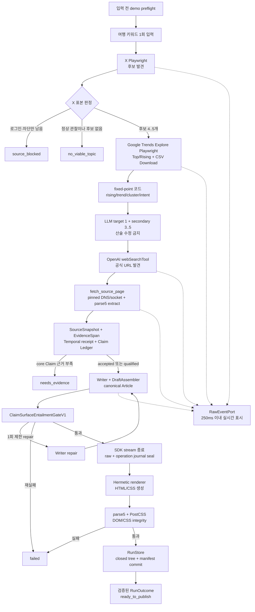

# 키워드 → 홈페이지 SEO/GEO 여행 글 자동 작성

여행 키워드 하나를 입력하면 X Playwright에서 후보를 발견하고, Google Trends Explore의 Related queries/topics와 UI Download CSV를 수집해 코드로 선점 점수를 계산한다. LLM은 타깃·보조 키워드의 의미 관계만 정한 뒤 공식 페이지 Claim을 별도로 검증하며, Writer 결과는 의미 함의·결정론적 렌더 검증을 통과해야 정적 홈페이지로 저장된다.

세부 계약이 충돌하면 [ARCHITECTURE-SPINE.md](../_bmad-output/planning-artifacts/architecture/architecture-yai_ai-2026-08-01/ARCHITECTURE-SPINE.md)가 유일한 아키텍처 원본이다. 이 문서는 구현자가 빠르게 읽는 실행 요약이다.

## 제품·대회 계약

- AGENT:24 `Creative Agent` 트랙의 글·리서치 자동화 에이전트다.
- 자연어 입력은 여행 키워드 한 번뿐이다. 입력 뒤 승인, 로그인, 추가 key 입력 없이 terminal까지 자율 실행한다.
- 라이브 데모와 즉석 태스크는 같은 `competition_live` production 경로를 사용한다.
- `competition_live` budget은 wall clock 105초, top-level tool 최대 8회, X query 최대 2개, stage retry 최대 1회이며 parallel tool call을 허용하지 않는다.
- OpenAI Agents SDK는 `stream: true`로 실행한다. raw SDK event는 전용 세컨드 화면과 저장 journal에 같은 순서로 남긴다.
- fixture, replay, mock, canned result는 테스트에만 쓸 수 있고 라이브 성공 근거가 될 수 없다.
- 성공 산출물은 `public/index.html`과 `public/styles.css`다.
- CMS, React/Next.js 웹 앱, 클라이언트 JavaScript, 상품 catalog, 상품 적합도, X 게시·승인·영수증은 범위 밖이다.

한 줄 실행 명령은 다음과 같다.

> 여행 키워드 하나로 X 후보 발견 → Google Trends Explore 수집·결정론적 점수 → 타깃·보조 키워드 선정 → 공식 웹 근거 수집 → Claim 검증 → SEO/GEO 여행 글 작성 → 검증된 정적 홈페이지 저장까지 스스로 수행하라.

## 전체 워크플로우

아래 주 경로의 순서를 바꾸지 않는다.



주요 책임은 다음처럼 분리한다.

| 단계 | 단일 책임 | 본문 사실 근거 여부 |
| --- | --- | --- |
| X Playwright | 여행 화제 후보 발견 | 아니요 |
| Google Trends Playwright | 동일 설정으로 후보 선점 가능성 원본 수집 | 아니요 |
| deterministic scorer/KeywordSelector | 점수 계산과 의미적 target/secondary 선정 | 아니요 |
| `webSearchTool` | 공식 후보 URL 발견 | URL만 사용 |
| `fetch_source_page` | live capability와 pinned socket으로 실제 HTML 수집·추출 | causal receipt가 있는 추출 block만 가능 |
| Source/Claim | EvidenceSpan admission과 atomic Claim 판정 | 예 |
| Writer | 허용된 Claim으로 초안 생성 | 새 사실 생성 금지 |
| Entailment Gate | surface가 Claim을 정확히 함의하는지 검사 | 성공 필수 |
| Renderer | canonical content를 HTML/CSS exact bytes로 변환 | 내용 변경 금지 |
| RunStore | sealed bytes와 manifest를 원자 저장 | 성공의 유일한 commit 경계 |

## 1. X와 Google: 브라우저 후보 수집

X와 Google adapter는 각각 Agents SDK `tool()` wrapper로만 호출한다.

- X tool: `search_x_with_playwright`
- Google tool: `evaluate_google_trends_with_playwright`
- 두 wrapper는 strict input/output schema, `parallelToolCalls: false`를 사용한다.
- wrapper `execute`의 실제 `ToolCallDetails.toolCall.callId`를 `BrowserRuntime`에 넘긴다.
- `BrowserRuntime`만 `MCPServerStdio.callToolResult()`를 직접 호출하고 operation call/result를 기록한다.
- X와 Google은 별도 persistent profile/context와 lease를 쓰며, X lease 종료 뒤 Google lease를 연다.
- 기존 `.browser-profile/`, no-argument Playwright MCP factory, `profile:login`, `search:raw`, `search`는 그대로 유지한다.

X는 visible post만 읽는다. 보이지 않는 참여도나 게시 시각을 추정하지 않는다. URL 또는 정규화 본문 hash로 중복을 제거하고, observed seed relevance·독립 반복·recency·query spread로 후보 4..5개를 만든다. 합성 없이 4개 미만이면 `no_viable_topic`이다. `competition_live`에서는 X query가 최대 2개다.

Google은 모든 후보를 하나의 search-term comparison Explore에서 `KR`, 최근 7일, Web Search로 조회한다. 후보별 Related queries/topics Top/Rising을 화면에서 읽고 Interest over time은 그래프가 아니라 Download control을 `browser_click`해 받은 CSV exact bytes로 파싱한다. 비공식 internal API/XHR 직접 호출은 금지한다. Config, 시각, Explore URL, raw CSV/screen hash와 provenance를 저장한다.

fixed-point scorer는 `0.40×rising - 0.25×trend - 0.20×cluster - 0.15×intent`를 계산한다. Breakout=1, 증가율=`min(percent/500,1)`, Top-only=0.3; trend는 latest complete 24시간의 actual-time OLS를 `clamp((delta24+100)/200,0,1)`로 정규화한다. cluster는 Related topics stable union count/5, intent는 code pattern 우선·ambiguous-only closed LLM이다. unavailable은 null이며 0 대입이나 재가중하지 않는다. complete가 없으면 X fallback과 degraded warning을 남긴다. Google raw·점수는 Writer에게 전달하지 않는다.

### 브라우저 인과 영수증

라이브 출처는 문자열로 자기 선언할 수 없다. browser 영수증과 operation journal이 하나의 인과 사슬을 만든다.

```ts
type BrowserLeaseReceiptV1 = {
  schemaVersion: "1.0";
  leaseId: string;
  runId: string;
  mode: "live";
  profile: "x" | "google_trends";
  connectedAt: string;
  serverInfoSha256: string;
  nonceSha256: string;
};

type BrowserInvocationReceiptV1 = {
  schemaVersion: "1.0";
  runId: string;
  invocationId: string;
  parentToolCallId: string;
  leaseId: string;
  stage: "collecting_x" | "evaluating_google";
  requestSha256: string;
  resultSha256: string;
  firstSeq: number;
  lastSeq: number;
  operationCount: number;
  status: "completed" | "failed";
};

type ExtractorReceiptV1 = {
  schemaVersion: "1.0";
  extractorId: "x-signal-extractor-v1" | "google-trends-explore-extractor-v1";
  extractorBuildSha256: string;
  orderedOperationIds: string[];
  operationResultsSha256: string;
  output: CanonicalJsonValue;
  outputSha256: string;
};

type GoogleCsvDownloadReceiptV1 = {
  schemaVersion: "1.0";
  runId: string;
  parentToolCallId: string;
  leaseId: string;
  invocationId: string;
  clickOperationId: string;
  exploreUrl: string;
  relativeFilename: string;
  rawArtifactId: string;
  byteLength: number;
  csvSha256: string;
  receiptSha256: string;
};

type WrapperCausalReceiptV1 = {
  schemaVersion: "1.0";
  parentToolCallId: string;
  leaseId: string;
  leaseReceiptSha256: string;
  invocationReceiptSha256: string;
  downloadReceiptSha256s: string[];
  extractorReceiptSha256: string;
  outputSha256: string;
};
```

`CausalProvenanceGateV1`은 lease nonce, parent SDK call ID, 연속된 operation pair/order, invocation seq 범위, trust-policy extractor/parser hash, extractor 재실행 output, wrapper semantic result의 deep equality를 검증한다. Google은 click operation→새 regular file→download receipt→embedded raw CSV bytes/hash까지 추가로 검증한다. operation이 없거나 어느 한 값이라도 다르면 live provenance와 성공을 발급하지 않는다. Operation journal은 operation마다 call 바로 다음 result가 있어야 하며 `rowCount = 2 * operationCount`, `lastSeq = rowCount`다.

## 2. 웹 URL 발견과 strict fetch/extract

`webSearchTool`과 `fetch_source_page`의 역할은 분리한다.

1. `webSearchTool`의 completed `action.sources[]`에서 후보 URL만 발견한다.
2. 열린 `resultsPayload`의 문장·제목·locator는 Evidence로 쓰지 않는다.
3. `SourceDiscoveryRegistry`가 current-run discovery URL과 hosted call ID를 순서대로 고정한다.
4. strict Agents SDK function tool `fetch_source_page`만 등록된 URL과 actual parent callId를 process-private `LiveFetchCapability`로 가져온다.
5. successful fetch/extract 결과에서만 `SourceSnapshot`과 `EvidenceSpan`을 만든다.

Fetcher의 닫힌 정책은 다음과 같다.

- HTTPS, empty username/password/hash, actual-secret byte 부재
- percent-decode 후 ASCII lower-case query key가 `authorization`, `api_key`, `apikey`, `token`, `access_token`, `refresh_token`, `signature`, `sig`, `x-amz-signature`, `x-goog-signature`이면 거절
- redirect 최대 3회, 각 hop마다 HTTPS·discovery host 또는 명시적 official host rule 재검증
- hop마다 DNS를 한 번 resolve해 global-unicast IP set만 승인하고 private/loopback/link-local/ULA/multicast/reserved/documentation 주소를 거절
- exact `undici@7.21.0` custom lookup으로 승인 IP에 socket을 pin하면서 original Host/TLS SNI를 보존하고 actual `remoteAddress` membership을 기록
- timeout 10초, decompressed body 최대 1 MiB
- status `200`, content type `text/html`, charset absent 또는 UTF-8만 허용
- PDF, JS-only/login page, 다른 charset, 빈 본문은 다른 Source를 찾거나 `needs_evidence`

`FetchInvocationReceiptV1`과 `FetchCausalReceiptV1`은 capability nonce, parent callId, trust-pinned transport, hop DNS/socket/TLS, compressed/decompressed body, extractor input/output와 wrapper semantic result를 결속한다. `FetchCausalProvenanceGateV1`이 이를 재계산한 경우에만 Source `live` provenance가 성립하며, unpinned 일반 fetch와 canned result는 live가 아니다.

`SourceTextExtractorV1`은 parse5 document order에서 `title,h1,h2,h3,h4,h5,h6,p,li,dt,dd`만 읽고 `script,style,noscript,template,svg,canvas` subtree를 제외한다. 텍스트는 entity decode → CRLF/CR을 LF로 변환 → Unicode whitespace run을 ASCII space 하나로 변환 → NFC → outer trim 순서로 처리한다.

- `domPath`: tag와 element-sibling index의 root-relative path
- `blockId`: `"block_" + first24hex(SHA256(finalUrl + "\0" + domPath + "\0" + text))`
- 최대 60 blocks, 전체 65,536 UTF-8 bytes의 document-order prefix
- `textSha256 = SHA256(UTF8(text))`
- `resultSha256`: 자신을 제외한 성공 result object의 `CanonicalJsonV1` SHA-256

SourceSnapshot은 `publishedAt:null`, `validAt:null`, 별도 `retrievedAt`을 갖고 discovery provenance와 passed fetch causal provenance를 모두 가져야 한다. `EvidenceSpan`은 fetched block의 `[startUtf8Byte,endUtf8Byte)` code-point boundary를 가리키며, slice를 decode한 값과 excerpt가 byte-equal해야 한다.

`retrievedAt`은 적용 시각이 아니다. `TemporalEvidenceExtractorV1`이 EvidenceSpan 안의 exact ASCII `YYYY-MM-DD` literal/range를 검증해 만든 `TemporalEvidenceReceiptV1`만 Claim `validAt`이 될 수 있다.

## 3. Claim Ledger와 Writer 경계

- 정부·지자체·관광청·대사관·교통사·시설 공식 사이트를 우선한다.
- admitted Source는 Config의 exact final-host rule, current-run discovery, successful fetch result를 모두 만족해야 한다.
- `ClaimRecord.text`는 검증 가능한 atomic proposition 하나만 담는다.
- 본문에 쓸 수 있는 Claim status는 `accepted | qualified`뿐이다.
- 각 허용 Claim은 admitted SourceSnapshot의 기존 EvidenceSpan을 가리키는 EvidenceLink가 하나 이상 있어야 한다.
- 가격·운영시간·교통·입국·안전 같은 고변동/risk Claim은 A급 official Source와 exact TemporalEvidenceReceipt가 필요하며 없으면 `stale`다.
- supporting Claim이 부족하면 해당 문장이나 섹션을 삭제한다.
- core Claim이 추가 조사 1회 뒤에도 부족하면 `needs_evidence`로 끝낸다.

Writer는 [writer-persona.md](../docs/writer-persona.md)의 versioned PersonaSnapshot을 Writer와 1회 repair에서만 사용한다. Writer에는 X/Google 원문, web-search `resultsPayload`, fetched page 전체, excluded Source, rejected Claim, raw event를 주지 않는다.

Writer 입력은 ContentBrief, PersonaSnapshot, accepted/qualified Claim projection, admitted Source에서만 만든 URL 없는 `WriterSourceProjectionV1 { sourceId, publisher, title, checkedAt: retrievedAt }`, WriterLinkChoice뿐이다. 원문 block·Evidence excerpt는 Claim/entailment 검증 경계에만 두고 Writer에게 직접 전달하지 않는다. 모든 `DraftTextUnit`은 `assertion: "fact"`와 정확히 하나의 `claimId`를 가진다. Writer는 HTML, CSS, URL, table, JSON-LD, image, script, 게시 명령, 품질 통과 선언을 만들지 않는다.

링크는 Persona가 아니라 `ConfigSnapshotV1.siteLinkRegistry`가 소유한다. Writer에는 URL과 label ID를 뺀 `{ linkCandidateId, kind, displayLabel }`만 보여준다. `DraftAssembler`만 allowlisted absolute HTTPS URL을 canonical content에 넣는다. CTA는 최대 하나이고 마지막 block이어야 한다.

## 4. DraftAssembler와 canonical Article

`DraftAssembler`는 Writer 출력을 신뢰 경계 밖의 `CanonicalArticleContentV1`으로 바꾼다.

1. 모든 unit/block/pair ID, block cardinality, heading FSM을 검증한다.
2. `unitId → RFC 6901 JSON Pointer → surfaceId`를 결정론적으로 일대일 매핑한다.
3. Writer surface마다 허용 Claim ID 하나를 그대로 `ClaimUsage`로 옮긴다. prose에서 Claim을 추론하지 않는다.
4. system link label만 `origin: "system_link"`, `assertion: "instruction"`, Claim 0개로 합성한다.
5. 선택한 link ID를 registry의 canonical absolute HTTPS URL로 resolve한다.
6. title → metaDescription → block DFS 순서로 `surfaceIndex`를 만든다.

`SurfaceIndexValidatorV1`은 저장된 index를 신뢰하지 않고 canonical body에서 pointer, ID 공식, exact UTF-8 text hash, origin, assertion, ClaimUsage cardinality를 모두 재계산해 deep-equal을 요구한다.

`contentRevisionSha256 = SHA256(CanonicalJsonV1(CanonicalArticleContentV1))`다. 이 hash 뒤에는 Assembler, Gate, renderer, RunStore 어느 단계도 content string·순서·URL을 바꿀 수 없다. repair가 발생하면 새 draft 전체를 다시 assemble·index·hash한다.

AI 작성 고지는 Writer가 만들지 않는다. DraftAssembler가 exact `DISCLOSURE_LITERAL_V1 = "이 글은 AI의 도움을 받아 작성되었습니다."`만 canonical footer field에 넣으며 다른 prefix·suffix·브랜드 사실을 허용하지 않는다.

## 5. Claim 의미 검증과 품질 Gate

구조적 Claim cardinality만으로 의미 일치를 선언하지 않는다. `ClaimSurfaceEntailmentGateV1`이 Writer/Assembler 뒤, raw journal seal 전에 모든 factual surface를 검사한다.

- 입력은 factual surface order의 `EntailmentItemInputV1[]`다.
- `ExecutionTrustPolicyV1`이 고정한 OpenAI `gpt-5.4-mini`, exact prompt, strict output schema를 사용한다.
- output의 surfaceId, claimId, 순서가 입력과 exact match해야 한다.
- 모든 verdict가 `entailed`여야 한다.
- qualified Claim은 `qualificationPresent: true`여야 한다.
- `validAt !== null`인 Claim은 `validAtPresent: true`여야 한다.
- timeout, schema 오류, unrelated Claim, evidence mismatch는 fail-closed다.

```ts
type ClaimSurfaceEntailmentReceiptV1 = {
  schemaVersion: "1.0";
  checker: "openai_responses_structured_v1";
  model: "gpt-5.4-mini";
  promptSha256: string;
  schemaSha256: string;
  inputSha256: string;
  responseId: string;
  rawOutputSha256: string;
  items: EntailmentItemOutputV1[];
  checkedAt: string;
  receiptSha256: string;
};
```

실패하면 같은 Persona와 제한된 Claim 입력으로 Writer repair를 한 번만 허용한다. 이후 전체 assemble/index/entailment를 다시 실행하며, 두 번째 실패는 `failed`다. Receipt는 `private/quality.json`과 manifest graph에 결속한다.

그 밖의 Gate는 evidence, freshness, integrity, provenance, writer contract, original value, SEO, GEO, safety, render integrity다. 모든 Gate proof의 policy hash는 Run의 `ExecutionTrustPolicyV1`과 일치해야 한다.

## 6. Raw SDK event와 두 sealed journal

SDK binding은 다음 exact 문자열이다. 다른 version은 fail-closed다.

```text
@openai/agents@0.14.2|@openai/agents-core@0.14.2|@openai/agents-openai@0.14.2|openai@6.49.0
```

`SemanticProjectionV1`은 정확히 다음 10개 variant만 가진다.

| 순서 | `projectionType` | SDK 대상 |
| --- | --- | --- |
| 1 | `x_playwright.call` | `search_x_with_playwright` function call |
| 2 | `x_playwright.result` | X strict `ToolResult` |
| 3 | `google_trends_explore_playwright.call` | `evaluate_google_trends_with_playwright` function call |
| 4 | `google_trends_explore_playwright.result` | Google strict `ToolResult` |
| 5 | `source_fetch.call` | `fetch_source_page` function call |
| 6 | `source_fetch.result` | fetch strict `ToolResult` |
| 7 | `openai_web_search.result` | hosted `web_search_call`의 completed action/result |
| 8 | `openai_google_intent.completed` | ambiguous-only intent `response.completed` |
| 9 | `openai_keyword_selector.completed` | KeywordSelector `response.completed` |
| 10 | `openai_entailment.completed` | one-turn/no-tool entailment `response.completed` |

`RawEventSerializerV1`은 run item에서 `{ type, name, item: event.item.toJSON() }`을 만든다. BigInt, function, symbol, cycle, non-finite number와 array의 `undefined`는 거절한다. 그 뒤 intrinsic `JSON.stringify` → `JSON.parse` → strict `CanonicalJsonValue`를 적용한다. object property의 `undefined`만 JSON 규칙으로 빠진다. 이 하나의 JSON-safe snapshot이 세컨드 화면 redaction, raw JSONL, semantic projection의 공통 입력이다.

`RawEventIngress`는 event type/name/key를 축약하거나 재명명하지 않고 secret value만 redaction한다. 수신 250ms 이내 전용 `RawEventPort`에 한 줄 JSON을 flush하고, 같은 순서의 envelope를 `private/events.jsonl`에 기록한다. stdout, stderr, progress, MCP operation log는 별도 channel이다.

stream 종료 뒤 raw journal을 한 번 seal한다. `private/run.json`에는 immutable redaction plan과 모든 seq의 `{ seq, semanticPayloadSha256, redactedEventSha256 }` audit entry를 저장한다. live port와 저장본의 event count·ordered hash가 다르거나 seal 뒤 append되면 success manifest를 만들 수 없다.

직접 Playwright MCP call/result는 SDK raw journal이 아니라 `private/operations.jsonl`에 기록한다. 두 journal 모두 redaction plan, exact byte length/hash, ordered digest를 가진 receipt로 seal된다.

```ts
type FrozenRawJournalReceipt = {
  schemaVersion: "1.0";
  runId: string;
  firstSeq: 1 | null;
  lastSeq: number;
  eventCount: number;
  orderedEventHashAlgorithm: "sha256-canonical-jsonl-v1";
  orderedEventSha256: string;
  semanticProjectionHashAlgorithm: "sha256-length-prefixed-audit-entry-v1";
  semanticProjectionSha256: string;
  redactionPlanSha256: string;
  fileByteLength: number;
  fileSha256: string;
  sealedAt: string;
};

type FrozenOperationJournalReceiptV1 = {
  schemaVersion: "1.0";
  runId: string;
  firstSeq: 1 | null;
  lastSeq: number;
  operationCount: number;
  rowCount: number;
  orderedOperationHashAlgorithm: "sha256-canonical-jsonl-v1";
  orderedOperationSha256: string;
  redactionPlanSha256: string;
  fileByteLength: number;
  fileSha256: string;
  sealedAt: string;
};
```

## 7. 실행 신뢰 정책과 결정론적 renderer

Run 시작 시 다음 정책 object와 JCS hash를 ConfigSnapshot에 고정한다.

```ts
type ExecutionTrustPolicyV1 = {
  schemaVersion: "1.0";
  policyId: "hackathon-p0-trust-v1";
  nodeMajor: 24;
  rendererBuildRecipeSha256: string;
  rendererBuildSha256: string;
  integrityBuildSha256: string;
  browserExtractorBuildSha256: string;
  sourceExtractorBuildSha256: string;
  deterministicGatesBuildSha256: string;
  templateSha256: string;
  themeSha256: string;
  entailment: {
    provider: "openai";
    model: "gpt-5.4-mini";
    promptSha256: string;
    schemaSha256: string;
  };
  cssPolicyId: "fixed-theme-css-allowlist-v1";
};
```

정책은 build 뒤 `config/execution-trust-policy-v1.json`의 literal로 freeze한다. Production loader가 현재 executable이나 fixture에서 expected hash를 생성하면 안 된다.

Renderer identity는 다음 exact field를 가진다.

```ts
type RendererSnapshot = {
  rendererVersion: string;
  rendererBuildRecipe: "hermetic-esbuild-bundle-v1";
  rendererBuildRecipeSha256: string;
  nodeRuntime: "node-24";
  buildDependencies: {
    esbuild: "0.28.1";
    htmlParser: "parse5@8.0.1";
    cssParser: "postcss@8.5.25";
  };
  rendererBuildSha256: string;
  integrityBuildSha256: string;
  templateSha256: string;
  themeVersion: string;
  themeSha256: string;
};
```

실행 대상은 import-free IIFE 두 개다.

- `dist/static-html-renderer-v1.mjs`: renderer, serializer, helper, compiled shell AST 포함
- `dist/render-integrity-v1.mjs`: parse5, PostCSS, DOM/CSS policy 포함

`HermeticBundleLoaderV1`은 regular non-symlink exact bytes/hash를 확인하고 capability-limited `vm.Script`에서 bundle을 실행한다. 이는 악성 코드 sandbox가 아니라 source-controlled bundle의 실행 capability와 결정론을 제한하는 gate다.

Renderer는 immutable `ArticleRenderInputV1`만 읽고 `public/index.html`, `public/styles.css`의 exact `Uint8Array`를 만든다. 모델, Agent tool, Persona, registry, network를 호출하지 않는다. `index.html`은 `./styles.css` 하나만 참조하며 script, image, external font/CSS, table, JSON-LD를 포함하지 않는다.

### `FixedThemeCssAllowlistV1`

- selector: `HtmlAstV1` exact tag/class/id와 descendant/child combinator만 허용
- 금지 selector: universal, attribute, pseudo, pseudo-element
- at-rule: 없거나 exact `@media (max-width: 720px)` 하나
- 금지: custom property, `!important`, 모든 function, URL, animation, keyframes
- property exact allowlist: `box-sizing,margin,margin-top,margin-bottom,margin-inline,padding,padding-top,padding-bottom,padding-inline,max-width,font-family,font-size,font-weight,line-height,letter-spacing,color,background-color,border,border-top,border-radius,display,grid-template-columns,gap,text-decoration,list-style-position,overflow-wrap,word-break`
- `display`: `block | inline | inline-block | flex | grid | list-item`
- `font-size`: `>=12px` 또는 `>=0.75rem`
- margin/padding/gap: non-negative, margin만 `auto` 허용
- max-width: positive
- color/background: trust policy의 opaque hex tuple만 허용
- 나머지 property value: policy의 exact literal tuple만 허용

`width`, `height`, `min-height`, `max-height`, `overflow`, `opacity`, `filter`, `visibility`, `position`, `inset`, `transform`, `z-index`, `clip`, `mask`, `text-indent`는 allowlist 밖이므로 자동 실패한다. pinned theme exact bytes, CSS allowlist, closed DOM grammar, `DomTextExhaustivenessGateV1`을 모두 통과해야 render integrity가 성공한다.

## 8. Exact output과 RunStore commit

성공 graph의 root object field는 다음과 같다.

```ts
type ArtifactRootV1 = {
  schemaVersion: "1.0";
  runId: string;
  generatedAt: string;
};

type RunArtifactV1 = ArtifactRootV1 & {
  normalizedRequest: NormalizedRequestV1;
  normalizedRequestSha256: string;
  configSnapshot: ConfigSnapshotV1;
  configSnapshotSha256: string;
  executionMode: "live" | "non_live";
  provenanceRegistry: ProvenanceRegistrySnapshotV1;
  derivedTaint: DerivedTaintV1;
  openai: OpenAiRunRefsV1;
  personaSnapshotId: string;
  personaSnapshotSha256: string;
  browserLeases: BrowserLeaseReceiptV1[];
  browserInvocations: BrowserInvocationReceiptV1[];
  googleCsvDownloads: GoogleCsvDownloadReceiptV1[];
  browserCausalReceipts: WrapperCausalReceiptV1[];
  redactionPlan: RedactionPlanV1;
  rawJournalAudit: SealedRawAuditIndexV1;
  operationsJournal: FrozenOperationJournalReceiptV1;
};

type SignalsArtifactV1 = ArtifactRootV1 & {
  x: XSignalBatch;
  candidates: TopicCandidate[];
  googleExplore: GoogleExploreBatchToolPayloadV1;
  googleEvaluations: GoogleTrendEvaluationV1[];
  keywordSelection: KeywordSelectionV1;
  contentBrief: ContentBriefV1;
};

type EvidenceArtifactV1 = ArtifactRootV1 & {
  fetchedSources: FetchSourceResultV1[];
  sources: SourceLedgerEntry[];
  claims: ClaimRecord[];
};

type QualityArtifactV1 = ArtifactRootV1 & {
  gateResults: GateResult[];
  entailmentReceipt: ClaimSurfaceEntailmentReceiptV1;
  repairAttempts: number;
  surfaceIndex: ArticleSurface[];
  renderCoverage: RenderCoverage[];
};

type ValidatedArticleArtifactV1 = {
  schemaVersion: "1.0";
  runId: string;
  generatedAt: string;
  contentRevisionSha256: string;
  content: CanonicalArticleContentV1;
  qualityReport: { passed: true; gateResultIds: string[] };
  staticSite: StaticSiteBundle;
};

type RunCommitBundleV1 = {
  runId: string;
  run: RunArtifactV1;
  signals: SignalsArtifactV1;
  evidence: EvidenceArtifactV1;
  quality: QualityArtifactV1;
  article: ValidatedArticleArtifactV1;
  render: StaticRenderResult;
  rawJournal: {
    fileBytes: Uint8Array;
    receipt: FrozenRawJournalReceipt;
    auditIndex: SealedRawAuditIndexV1;
  };
  operationsJournal: {
    fileBytes: Uint8Array;
    receipt: FrozenOperationJournalReceiptV1;
  };
};
```

성공 디렉터리의 closed layout은 다음과 같다.

```text
output/.staging/{runId}/
├── public/
│   ├── index.html
│   └── styles.css
└── private/
    ├── article.json
    ├── evidence.json
    ├── events.jsonl
    ├── manifest.json
    ├── operations.jsonl
    ├── quality.json
    ├── run.json
    └── signals.json

output/runs/{runId}/  # commit 뒤 동일한 closed tree
```

Manifest의 artifact tuple은 아래 9개 path를 이 순서 그대로 가진다. `private/manifest.json` 자신은 tuple에 포함하지 않는다.

```ts
type SuccessArtifactTupleV1 = readonly [
  ManifestArtifact<"public/index.html">,
  ManifestArtifact<"public/styles.css">,
  ManifestArtifact<"private/run.json">,
  ManifestArtifact<"private/signals.json">,
  ManifestArtifact<"private/evidence.json">,
  ManifestArtifact<"private/quality.json">,
  ManifestArtifact<"private/article.json">,
  ManifestArtifact<"private/events.jsonl">,
  ManifestArtifact<"private/operations.jsonl">,
];

type SuccessManifestV1 = {
  schemaVersion: "1.0";
  runId: string;
  generatedAt: string;
  terminalIntent: "ready_to_publish";
  contentRevisionSha256: string;
  personaSnapshotSha256: string;
  executionTrustPolicySha256: string;
  entailmentReceiptSha256: string;
  renderer: RendererSnapshot;
  rawJournal: FrozenRawJournalReceipt;
  operationsJournal: FrozenOperationJournalReceiptV1;
  artifacts: SuccessArtifactTupleV1;
};

type RunOutcome = {
  runId: string;
  status: "ready_to_publish";
  manifestPath: "private/manifest.json";
  contentRevisionSha256: string;
};
```

Private JSON 6종은 `ArtifactJsonSerializerV1 = RFC 8785 JCS bytes + LF`로만 만든다. `events.jsonl`, `operations.jsonl`, 두 public file은 각 journal/renderer가 봉인한 exact bytes를 그대로 쓴다.

RunStore는 다음 순서를 지킨다.

1. trusted `output/.staging`, `output/runs` direct directory와 run path를 검증한다.
2. 0700 staging tree에 각 artifact를 `O_EXCL | O_NOFOLLOW`, mode 0600으로 쓴다.
3. 각 file을 fsync하고 다시 읽어 length/hash를 재검증한다.
4. `private/manifest.json`을 마지막에 쓴다.
5. private와 staging directory를 fsync한다.
6. 존재하지 않는 `output/runs/{runId}`로 atomic rename한다.
7. `output/runs` parent directory fsync가 성공한 뒤 final tree 전체를 재검증한다.
8. 그때만 `RunOutcome.status = "ready_to_publish"`을 반환한다.

Extra file, directory, symlink, socket, device, macOS metadata inode, missing/reordered artifact, hash 불일치, invalid receipt가 있으면 성공이 아니다.

## 상태 계약

```ts
type RunStage =
  | "validating_input"
  | "collecting_x"
  | "clustering_topics"
  | "evaluating_google"
  | "selecting_topic"
  | "researching"
  | "verifying"
  | "drafting"
  | "quality_checking"
  | "rendering"
  | "persisting";

type TerminalStatus =
  | "ready_to_publish"
  | "needs_evidence"
  | "no_viable_topic"
  | "source_blocked"
  | "failed";
```

`ready_to_publish`은 Article이나 화면의 자기 선언이 아니다. closed `SuccessManifestV1`과 final tree를 다시 검증한 `RunOutcome`에서만 파생한다.

## 기존 X MVP 호환 계약

새 구현은 additive extension으로 진행하며 다음 기존 계약을 보존한다.

- `profile:login`, `search:raw`, `search`
- `XSearchResultSchema`와 현재 flat JSON 형식
- `.browser-profile/` 로그인 상태
- no-argument `createPlaywrightMcpServer()`
- `output/<timestamp>-<keyword>.json`
- stderr의 `{type,name,at}` progress projection과 stdout final JSON
- 기존 9개 테스트

새 Article 명령과 `output/runs/`는 기존 기능 옆에 additive extension으로 구현한다. `search:raw`는 연결 점검용이며 `competition_live` Article 성공 경로가 아니다.

## 구현 수용 기준

- [ ] X → Google Explore raw 수집 → deterministic score → KeywordSelector → web discovery → strict fetch/extract → Claim → Writer → entailment → raw seal → renderer → RunStore 순서를 지킨다.
- [ ] X와 Google은 strict Agents SDK `tool()` wrapper를 거치며 direct adapter bypass가 없다.
- [ ] Google은 같은 ConfigSnapshot으로 Related queries/topics와 UI Download CSV를 수집하고 internal API를 직접 호출하지 않는다.
- [ ] unavailable/null을 0으로 대입하지 않고 fixed-point scorer·24h OLS 결과를 raw refs/receipt로 재계산할 수 있다.
- [ ] Writer는 score/raw가 제거된 ContentBrief와 검증된 Claim만 받는다.
- [ ] browser lease/invocation/download/extractor/wrapper causal receipt와 operation journal이 SDK result에 결속된다.
- [ ] `SemanticProjectionV1`이 exact 10-variant union이고 SDK binding이 exact match한다.
- [ ] web search prose가 아니라 `action.sources[]`만 URL discovery에 쓰인다.
- [ ] `fetch_source_page`는 current-run discovered URL과 strict network/content 정책만 허용한다.
- [ ] 모든 accepted/qualified Claim은 fetched EvidenceSpan으로 resolve된다.
- [ ] Writer의 모든 factual surface가 Claim 하나와 연결되고 entailment gate를 통과한다.
- [ ] 실패 시 Writer repair는 한 번뿐이며 재실패는 `failed`다.
- [ ] raw SDK journal과 direct MCP operation journal이 각각 한 번 seal된다.
- [ ] ExecutionTrustPolicy의 executable/extractor/gate/template/theme/prompt/schema hash를 startup에서 검증한다.
- [ ] import-free renderer/integrity bundle과 pinned CSS theme가 exact hash를 만족한다.
- [ ] DOM exhaustive gate와 `FixedThemeCssAllowlistV1`을 통과한다.
- [ ] `public/`에는 `index.html`, `styles.css`만 존재한다.
- [ ] exact artifact fields, 9-path tuple, closed tree, receipt/hash graph가 일치한다.
- [ ] parent directory fsync와 final revalidation 뒤에만 `ready_to_publish`을 반환한다.
- [ ] fixture/replay/mock/canned path는 `competition_live` 성공을 만들 수 없다.
- [ ] 기존 X CLI, schema, profile, flat JSON, progress channel, 테스트를 그대로 유지한다.

## 참고

- [OpenAI Agents SDK streaming](https://openai.github.io/openai-agents-js/guides/streaming/)
- [OpenAI Agents SDK MCP](https://openai.github.io/openai-agents-js/guides/mcp/)
- [Google Trends 데이터 의미](https://support.google.com/trends/answer/4365533)
- [Google Trends CSV 내보내기](https://support.google.com/trends/answer/4365538)
- [Google Trends Related searches](https://support.google.com/trends/answer/4355000)
- [Google Trends 검색어 비교](https://support.google.com/trends/answer/4359550)
- [Playwright MCP](https://github.com/microsoft/playwright-mcp)
- [Google people-first content](https://developers.google.com/search/docs/fundamentals/creating-helpful-content)
